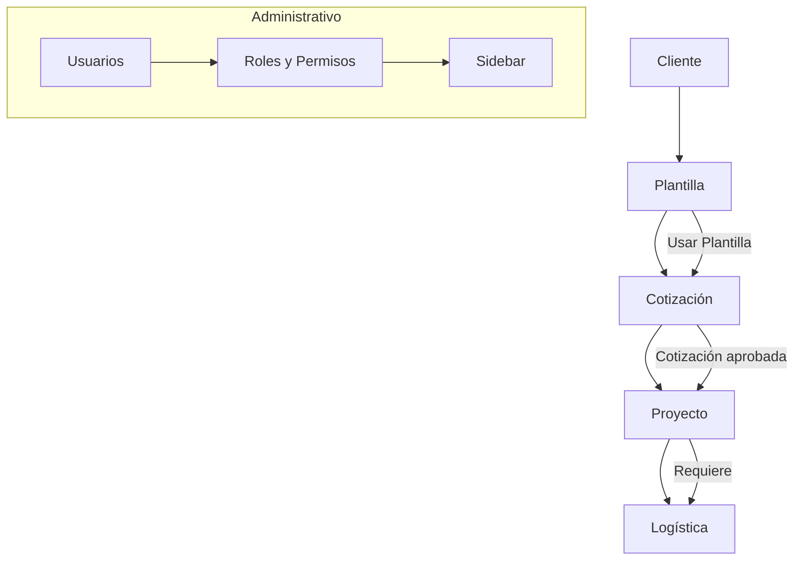

# 📑 DIAGRAMA_FLUJO_GYS.md — Diagrama de Flujo General GYS App

---

## 🧠 Descripción

Este diagrama representa el flujo funcional completo del sistema GYS App, desde la creación de clientes, plantillas y cotizaciones hasta proyectos y logística, incluyendo la gestión de usuarios y roles.

---

## 📋 Diagrama MERMAID

---

## 🎯 Explicación del flujo

- Un **Cliente** puede tener varias **Plantillas**.
- Una **Plantilla** se usa para crear una **Cotización**.
- Una **Cotización** aprobada genera un **Proyecto**.
- Un **Proyecto** solicita materiales y servicios vía **Logística**.
- La **Administración** maneja **Usuarios**, **Roles** y el control de acceso vía el **Sidebar** dinámico.

---

# 📄 Archivo recomendado

Guardar este documento como:
- `DIAGRAMA_FLUJO_GYS.md`

Para referencia visual y funcional del proyecto GYS App. ✅

