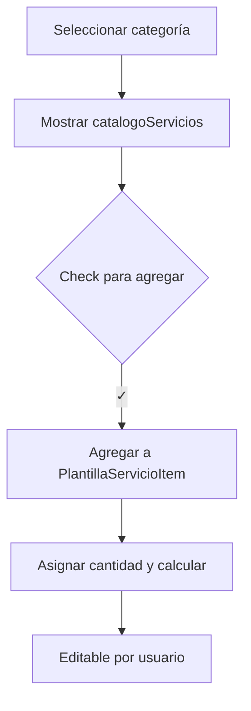

# 📑 FLUJO_FUNCIONAL_CATALOGO_SERVICIO.md — Flujo Funcional de CatalogoServicio GYS App

---

## 🧩 Objetivo funcional

`CatalogoServicio` representa los ítems de catálogo que serán utilizados como base para construir servicios dentro de una **plantilla** (`PlantillaServicioItem`), una **cotización** (`CotizacionServicioItem`) o un **proyecto** (`ProyectoServicioItem`).

Su rol es dinámico, reutilizable y seleccionable. Su creación implica el uso de **fórmulas** y **relaciones clave** que permiten el cálculo automático de horas-hombre (HH) y costos asociados.

---

## 🛠️ Construcción de la entidad

### Campos clave
- `nombre`, `descripcion`: Información general del servicio.
- `formula`: Tipo de fórmula que determina cómo se calcula la HH (`Proporcional`, `Escalonada`, `Fijo`).
- `horaBase`, `horaRepetido`, `horaUnidad`, `horaFijo`: Variables de fórmula.

### Relaciones necesarias
- `CategoriaServicio`: Agrupación lógica del servicio.
- `UnidadServicio`: Unidad con la que se mide el servicio (ej. "Plano", "Motor", "Item").
- `Recurso`: Profesional que ejecuta el servicio. Define el `costoHora` por defecto.

---

## 📦 Flujo para crear y administrar CatalogoServicio

| Paso | Acción                      | Detalles                                                                 |
|------|-----------------------------|--------------------------------------------------------------------------|
| 1    | Crear Categorías            | `CategoriaServicio` debe estar disponible para clasificación.            |
| 2    | Crear Recursos              | `Recurso` contiene `costoHora` y descripción del profesional.            |
| 3    | Crear Unidades de Servicio | `UnidadServicio` representa la unidad usada por cada servicio.           |
| 4    | Crear CatalogoServicio      | Se registra el servicio con fórmula, unidad, recurso y categoría.        |

> Al seleccionar el **Recurso**, se precarga automáticamente su `costoHora`.

---

## 🧠 Consumo dentro del sistema

### 🔄 En Plantillas (`PlantillaServicioItem`)
- El usuario selecciona una **categoría**.
- Se listan todos los `CatalogoServicio` vinculados a esa categoría.
- El usuario **marca con check** los servicios que desea añadir.
- Por cada ítem:
  - Se copia el `recursoId` y `costoHora`.
  - La fórmula define automáticamente `cantidadHoras`.
  - El usuario puede editar los valores según necesidad.

---

## 🎯 Lógica de Cálculo de Horas-Hombre

| Tipo de fórmula  | Fórmula de cálculo                                |
|------------------|----------------------------------------------------|
| Proporcional     | `costo = horaUnidad * cantidad * costoHora`       |
| Escalonada       | `costo = horaBase + (n - 1) * horaRepetido`       |
| Fijo             | `costo = horaFijo * costoHora`                    |

---

## ✅ Validaciones requeridas

| Fórmula        | Campos obligatorios               |
|----------------|-----------------------------------|
| Proporcional   | `horaUnidad`                     |
| Escalonada     | `horaBase`, `horaRepetido`       |
| Fijo           | `horaFijo`                        |

> El `costoHora` siempre proviene de la relación con `Recurso`.

---

## 📚 Flujo en la App

---

# 🚀 Notas adicionales

- El costo calculado es editable en las instancias de plantilla o proyecto.
- Se recomienda copiar `snapshotCostoHora` en vez de sólo `costoHora` si se busca preservar histórico.
- Futuras mejoras podrían incluir subagrupaciones por subcategorías si el catálogo crece.

