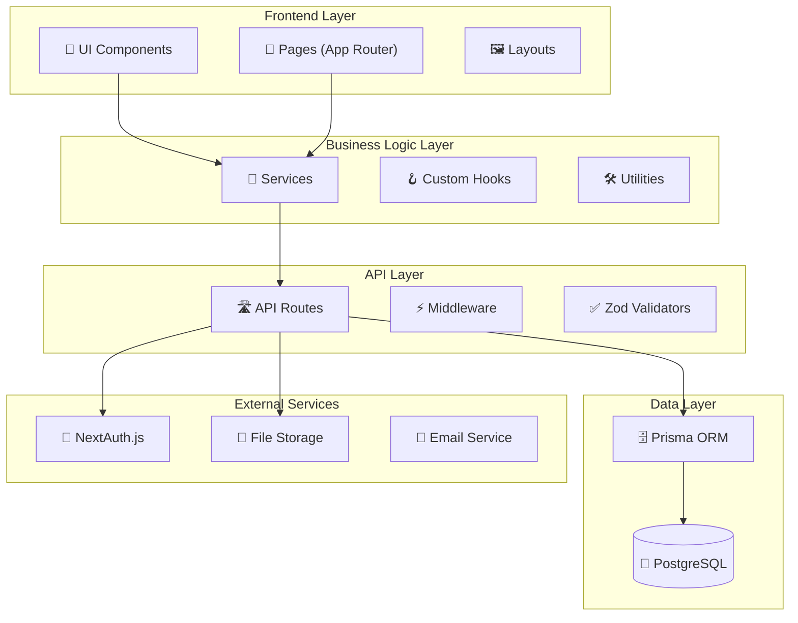
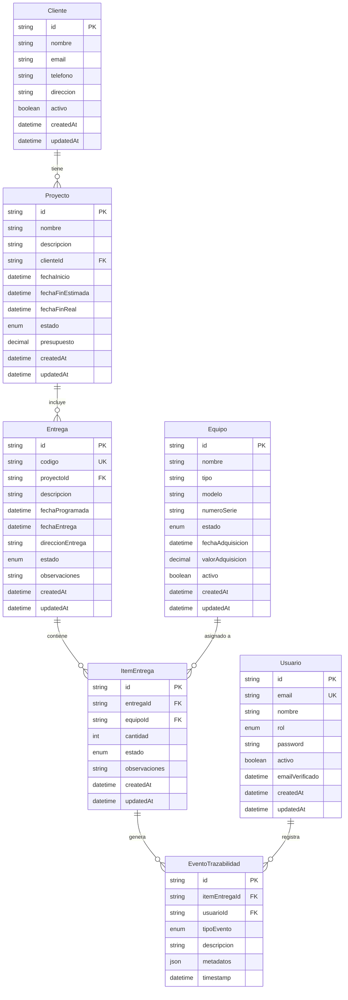

# 🏗️ Arquitectura del Sistema GYS

## 📋 Información General

**Proyecto:** Sistema de Gestión y Servicios (GYS)  
**Versión:** 1.0.0  
**Fecha:** Enero 2025  
**Autor:** TRAE - Agente Senior Fullstack  
**Tipo:** Documentación Técnica Enterprise  

---

## 🎯 Resumen Ejecutivo

El Sistema GYS es una aplicación web enterprise desarrollada con **Next.js 14+ (App Router)** que gestiona entregas, proyectos, equipos y reportes para empresas de servicios industriales. La arquitectura sigue principios **SOLID**, **Clean Architecture** y **Domain-Driven Design (DDD)**.

### Características Principales
- ✅ **Arquitectura Modular** con separación clara de responsabilidades
- ✅ **TypeScript Estricto** para type safety completo
- ✅ **Server Components** por defecto con Client Components selectivos
- ✅ **API REST** con validación Zod y manejo de errores robusto
- ✅ **Base de Datos Relacional** con Prisma ORM
- ✅ **Autenticación y Autorización** por roles con NextAuth.js
- ✅ **Testing Completo** (Unit, Integration, E2E)
- ✅ **UI/UX Moderna** con Tailwind CSS y shadcn/ui

---

## 🏛️ Arquitectura General

### Diagrama de Alto Nivel



### Principios Arquitectónicos

1. **Separation of Concerns**
   - Frontend: Presentación y UX
   - Business Logic: Reglas de negocio
   - API: Comunicación y validación
   - Data: Persistencia y consultas

2. **Dependency Inversion**
   - Interfaces definen contratos
   - Implementaciones dependen de abstracciones
   - Inyección de dependencias explícita

3. **Single Responsibility**
   - Cada módulo tiene una responsabilidad específica
   - Componentes pequeños y enfocados
   - Funciones puras cuando es posible

---

## 📁 Estructura del Proyecto

### Organización de Directorios

```
src/
├── app/                    # 🛣️ App Router (Next.js 14+)
│   ├── (comercial)/        # 💼 Módulo Comercial
│   ├── (proyectos)/        # 🏗️ Módulo Proyectos
│   ├── (logistica)/        # 🚚 Módulo Logística
│   ├── (admin)/            # ⚙️ Módulo Administración
│   ├── (catalogo)/         # 📋 Módulo Catálogo
│   ├── api/                # 🔌 API Routes
│   ├── globals.css         # 🎨 Estilos Globales
│   ├── layout.tsx          # 🖼️ Layout Principal
│   └── page.tsx            # 🏠 Página de Inicio
├── components/             # 🧩 Componentes Reutilizables
│   ├── ui/                 # 🎨 Componentes Base (shadcn/ui)
│   ├── catalogo/           # 📋 Componentes de Catálogo
│   ├── comercial/          # 💼 Componentes Comerciales
│   ├── proyectos/          # 🏗️ Componentes de Proyectos
│   ├── logistica/          # 🚚 Componentes de Logística
│   └── shared/             # 🤝 Componentes Compartidos
├── lib/                    # 📚 Librerías y Utilidades
│   ├── prisma.ts           # 🗄️ Cliente Prisma
│   ├── auth.ts             # 🔐 Configuración Auth
│   ├── logger.ts           # 📝 Sistema de Logs
│   ├── services/           # 🔧 Servicios de Negocio
│   ├── utils/              # 🛠️ Utilidades
│   └── validators/         # ✅ Esquemas de Validación
├── types/                  # 📝 Definiciones de Tipos
│   ├── modelos.ts          # 🏗️ Modelos de Dominio
│   ├── payloads.ts         # 📦 Payloads de API
│   └── ui.ts               # 🎨 Tipos de UI
├── __tests__/              # 🧪 Tests
│   ├── api/                # 🔌 Tests de API
│   ├── components/         # 🧩 Tests de Componentes
│   ├── services/           # 🔧 Tests de Servicios
│   └── e2e/                # 🎭 Tests End-to-End
└── middleware.ts           # ⚡ Middleware de Next.js
```

### Convenciones de Nomenclatura

- **Archivos**: `kebab-case` (ej: `entregas-list.tsx`)
- **Componentes**: `PascalCase` (ej: `EntregasList`)
- **Funciones**: `camelCase` (ej: `obtenerEntregas`)
- **Constantes**: `UPPER_SNAKE_CASE` (ej: `API_BASE_URL`)
- **Tipos**: `PascalCase` (ej: `EntregaCompleta`)
- **Interfaces**: `PascalCase` con prefijo `I` (ej: `IEntregaService`)

---

## 🔧 Stack Tecnológico

### Frontend

| Tecnología | Versión | Propósito |
|------------|---------|----------|
| **Next.js** | 14+ | Framework React con App Router |
| **React** | 18+ | Librería de UI |
| **TypeScript** | 5+ | Tipado estático |
| **Tailwind CSS** | 4+ | Framework CSS utility-first |
| **shadcn/ui** | Latest | Componentes UI modernos |
| **Framer Motion** | 11+ | Animaciones fluidas |
| **Lucide React** | Latest | Iconografía |
| **React Hook Form** | 7+ | Manejo de formularios |
| **Zod** | 3+ | Validación de esquemas |

### Backend

| Tecnología | Versión | Propósito |
|------------|---------|----------|
| **Next.js API Routes** | 14+ | API REST |
| **Prisma** | 5+ | ORM y migraciones |
| **PostgreSQL** | 15+ | Base de datos relacional |
| **NextAuth.js** | 4+ | Autenticación y autorización |
| **bcryptjs** | 2+ | Hashing de contraseñas |
| **jsonwebtoken** | 9+ | Tokens JWT |

### Testing

| Tecnología | Versión | Propósito |
|------------|---------|----------|
| **Jest** | 29+ | Framework de testing |
| **Testing Library** | 14+ | Testing de componentes React |
| **Playwright** | 1.40+ | Testing E2E |
| **MSW** | 2+ | Mocking de APIs |

### DevOps

| Tecnología | Versión | Propósito |
|------------|---------|----------|
| **Vercel** | Latest | Deployment y hosting |
| **GitHub Actions** | Latest | CI/CD |
| **ESLint** | 8+ | Linting de código |
| **Prettier** | 3+ | Formateo de código |

---

## 🗄️ Arquitectura de Datos

### Modelo de Dominio



### Patrones de Datos

1. **Repository Pattern**
   - Abstracción de acceso a datos
   - Servicios no dependen directamente de Prisma
   - Facilita testing con mocks

2. **Unit of Work**
   - Transacciones coordinadas
   - Consistencia de datos
   - Rollback automático en errores

3. **Domain Events**
   - Eventos de trazabilidad
   - Auditoría automática
   - Integración con sistemas externos

---

## 🔐 Seguridad

### Autenticación

- **NextAuth.js** con múltiples providers
- **JWT Tokens** con refresh automático
- **Session Management** seguro
- **Password Hashing** con bcrypt

### Autorización

- **Role-Based Access Control (RBAC)**
- **Middleware de autorización** en rutas
- **Validación de permisos** en componentes
- **API Protection** con verificación de roles

### Roles del Sistema

| Rol | Permisos | Descripción |
|-----|----------|-------------|
| **ADMIN** | Todos | Administrador del sistema |
| **GERENTE** | Gestión completa | Gerente general |
| **COMERCIAL** | Clientes, proyectos | Área comercial |
| **PROYECTOS** | Proyectos, entregas | Gestión de proyectos |
| **LOGISTICA** | Entregas, equipos | Logística y entregas |
| **GESTOR** | Lectura avanzada | Gestión y reportes |
| **COORDINADOR** | Coordinación | Coordinación operativa |
| **COLABORADOR** | Lectura básica | Colaborador general |

### Medidas de Seguridad

- ✅ **HTTPS** obligatorio en producción
- ✅ **CSRF Protection** con tokens
- ✅ **XSS Prevention** con sanitización
- ✅ **SQL Injection Prevention** con Prisma
- ✅ **Rate Limiting** en APIs críticas
- ✅ **Input Validation** con Zod
- ✅ **Error Handling** sin exposición de datos
- ✅ **Audit Logging** de acciones críticas

---

## 🚀 Performance

### Optimizaciones Frontend

1. **Server Components por Defecto**
   - Renderizado en servidor
   - Menor JavaScript en cliente
   - Mejor SEO y performance

2. **Client Components Selectivos**
   - Solo para interactividad
   - Lazy loading cuando es posible
   - Code splitting automático

3. **Caching Estratégico**
   - Next.js App Router cache
   - React Query para datos
   - Service Worker para assets

4. **Optimización de Imágenes**
   - Next.js Image component
   - WebP automático
   - Lazy loading nativo

### Optimizaciones Backend

1. **Database Optimization**
   - Índices estratégicos
   - Consultas optimizadas
   - Connection pooling

2. **API Optimization**
   - Response caching
   - Pagination eficiente
   - Selective field loading

3. **Monitoring**
   - Performance metrics
   - Error tracking
   - Database monitoring

---

## 🧪 Estrategia de Testing

### Pirámide de Testing

```
        🎭 E2E Tests (10%)
       ┌─────────────────┐
      ┌─────────────────────┐
     │  🔗 Integration (20%) │
    ┌─────────────────────────┐
   │     📦 Unit Tests (70%)   │
  └───────────────────────────┘
```

### Tipos de Tests

1. **Unit Tests (70%)**
   - Funciones puras
   - Servicios de negocio
   - Utilidades
   - Validadores

2. **Integration Tests (20%)**
   - API endpoints
   - Database operations
   - Component integration

3. **E2E Tests (10%)**
   - User journeys
   - Critical paths
   - Cross-browser testing

### Herramientas de Testing

- **Jest**: Unit e integration tests
- **Testing Library**: Component testing
- **Playwright**: E2E testing
- **MSW**: API mocking

---

## 📊 Monitoreo y Observabilidad

### Logging

- **Structured Logging** con Winston
- **Log Levels**: ERROR, WARN, INFO, DEBUG
- **Correlation IDs** para trazabilidad
- **Centralized Logging** en producción

### Métricas

- **Application Metrics**: Response time, throughput
- **Business Metrics**: Entregas, proyectos, usuarios
- **Infrastructure Metrics**: CPU, memoria, disco

### Alertas

- **Error Rate** > 5%
- **Response Time** > 2s
- **Database Connection** failures
- **Authentication** failures

---

## 🔄 CI/CD Pipeline

### GitHub Actions Workflow

```yaml
name: CI/CD Pipeline

on:
  push:
    branches: [main, develop]
  pull_request:
    branches: [main]

jobs:
  test:
    runs-on: ubuntu-latest
    steps:
      - name: Checkout
      - name: Setup Node.js
      - name: Install dependencies
      - name: Run linting
      - name: Run unit tests
      - name: Run integration tests
      - name: Run E2E tests
      - name: Generate coverage
  
  build:
    needs: test
    runs-on: ubuntu-latest
    steps:
      - name: Build application
      - name: Run security scan
      - name: Build Docker image
  
  deploy:
    needs: build
    runs-on: ubuntu-latest
    if: github.ref == 'refs/heads/main'
    steps:
      - name: Deploy to Vercel
      - name: Run smoke tests
      - name: Notify team
```

### Deployment Strategy

- **Blue-Green Deployment** para zero downtime
- **Feature Flags** para releases graduales
- **Rollback Automático** en caso de errores
- **Health Checks** post-deployment

---

## 📈 Escalabilidad

### Horizontal Scaling

- **Stateless Application** design
- **Load Balancing** con múltiples instancias
- **Database Read Replicas** para consultas
- **CDN** para assets estáticos

### Vertical Scaling

- **Resource Monitoring** continuo
- **Auto-scaling** basado en métricas
- **Performance Profiling** regular
- **Capacity Planning** proactivo

### Microservices Readiness

- **Domain Boundaries** bien definidos
- **API-First** approach
- **Event-Driven** architecture preparada
- **Service Mesh** compatible

---

## 🔮 Roadmap Técnico

### Corto Plazo (1-3 meses)
- ✅ **Testing Completo** implementado
- ✅ **Documentation** enterprise
- 🔄 **Performance Optimization**
- 🔄 **Security Hardening**

### Medio Plazo (3-6 meses)
- 📋 **Mobile App** (React Native)
- 📋 **Real-time Features** (WebSockets)
- 📋 **Advanced Analytics**
- 📋 **API Versioning**

### Largo Plazo (6-12 meses)
- 📋 **Microservices Migration**
- 📋 **Machine Learning** integration
- 📋 **Multi-tenant** architecture
- 📋 **Global Deployment**

---

## 📚 Referencias

- [Next.js Documentation](https://nextjs.org/docs)
- [React Documentation](https://react.dev)
- [Prisma Documentation](https://www.prisma.io/docs)
- [NextAuth.js Documentation](https://next-auth.js.org)
- [Tailwind CSS Documentation](https://tailwindcss.com/docs)
- [TypeScript Documentation](https://www.typescriptlang.org/docs)

---

**Documento generado por TRAE - Agente Senior Fullstack**  
**Última actualización:** Enero 2025  
**Versión:** 1.0.0