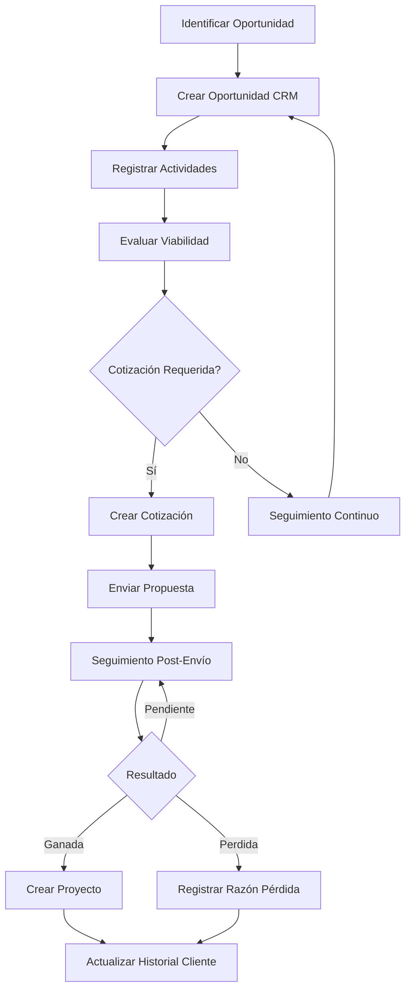

# 🆕 CRM Implementation Specification - Sistema GYS

## 📋 Resumen Ejecutivo

Este documento detalla la implementación completa de un sistema CRM (Customer Relationship Management) especializado para proyectos industriales en el sistema GYS. El CRM se integra perfectamente con el flujo existente de cotizaciones y proyectos, manteniendo la funcionalidad actual intacta mientras agrega capacidades avanzadas de gestión de relaciones comerciales.

## 🎯 Objetivos del Sistema CRM

- **Gestión de Oportunidades**: Seguimiento completo del pipeline de ventas
- **Análisis de Competidores**: Información detallada sobre competidores en licitaciones
- **Gestión de Contactos**: Base de datos de contactos por cliente
- **Historial de Proyectos**: Registro histórico de proyectos por cliente
- **Métricas Comerciales**: KPIs y métricas de rendimiento por usuario
- **Integración Fluida**: Con el sistema existente de cotizaciones y proyectos

---

## 🗄️ Arquitectura de Base de Datos

### 📋 Nuevos Modelos CRM

#### 1. CrmOportunidad
```prisma
model CrmOportunidad {
  id                    String   @id @default(cuid())
  clienteId             String
  nombre                String
  descripcion           String?
  valorEstimado         Float?
  probabilidad          Int      @default(0) // 0-100
  fechaCierreEstimada   DateTime?
  fuente                String?  // "licitación", "referido", "prospección"
  estado                String   @default("prospecto")
  prioridad             String   @default("media")
  comercialId           String?
  responsableId         String?
  fechaUltimoContacto   DateTime?
  notas                 String?
  competencia           String?
  createdAt             DateTime @default(now())
  updatedAt             DateTime @updatedAt

  // Relaciones
  cliente               Cliente  @relation(fields: [clienteId], references: [id])
  comercial             User?    @relation("CrmOportunidadComercial", fields: [comercialId], references: [id])
  responsable           User?    @relation("CrmOportunidadResponsable", fields: [responsableId], references: [id])
  cotizacionId          String?  @unique
  cotizacion            Cotizacion? @relation(fields: [cotizacionId], references: [id])
  actividades           CrmActividad[]

  @@index([clienteId, estado])
  @@index([comercialId, fechaCierreEstimada])
  @@map("crm_oportunidad")
}
```

#### 2. CrmActividad
```prisma
model CrmActividad {
  id            String   @id @default(cuid())
  oportunidadId String
  tipo          String   // "llamada", "email", "reunión", "propuesta", "seguimiento"
  descripcion   String
  fecha         DateTime
  resultado     String?  // "positivo", "neutro", "negativo"
  notas         String?
  usuarioId     String
  usuario       User     @relation(fields: [usuarioId], references: [id])
  createdAt     DateTime @default(now())
  updatedAt     DateTime @updatedAt

  oportunidad   CrmOportunidad @relation(fields: [oportunidadId], references: [id], onDelete: Cascade)

  @@index([oportunidadId, fecha])
  @@map("crm_actividad")
}
```

#### 3. CrmCompetidorLicitacion
```prisma
model CrmCompetidorLicitacion {
  id              String   @id @default(cuid())
  cotizacionId    String
  nombreEmpresa   String
  contacto        String?
  telefono        String?
  email           String?
  propuestaEconomica Float?
  propuestaTecnica   String?
  fortalezas         String?
  debilidades        String?
  precioVsNuestro    String?
  resultado         String?
  razonPerdida      String?
  createdAt         DateTime @default(now())
  updatedAt         DateTime @updatedAt

  cotizacion        Cotizacion @relation(fields: [cotizacionId], references: [id], onDelete: Cascade)

  @@index([cotizacionId])
  @@map("crm_competidor_licitacion")
}
```

#### 4. CrmContactoCliente
```prisma
model CrmContactoCliente {
  id            String   @id @default(cuid())
  clienteId     String
  nombre        String
  cargo         String?
  email         String?
  telefono      String?
  celular       String?
  esDecisionMaker     Boolean  @default(false)
  areasInfluencia     String?
  relacionComercial   String?
  fechaUltimoContacto DateTime?
  notas               String?
  createdAt           DateTime @default(now())
  updatedAt           DateTime @updatedAt

  cliente             Cliente  @relation(fields: [clienteId], references: [id], onDelete: Cascade)

  @@index([clienteId, esDecisionMaker])
  @@map("crm_contacto_cliente")
}
```

#### 5. CrmHistorialProyecto
```prisma
model CrmHistorialProyecto {
  id              String   @id @default(cuid())
  clienteId       String
  proyectoId      String?
  cotizacionId    String?
  nombreProyecto  String
  tipoProyecto    String
  sector          String?
  complejidad     String?
  valorContrato   Float?
  margenObtenido  Float?
  duracionDias    Int?
  fechaInicio     DateTime?
  fechaFin        DateTime?
  fechaAdjudicacion DateTime?
  calificacionCliente Int?
  retroalimentacion  String?
  exitos            String?
  problemas         String?
  recomendaciones   String?
  createdAt         DateTime @default(now())
  updatedAt         DateTime @updatedAt

  cliente           Cliente     @relation(fields: [clienteId], references: [id], onDelete: Cascade)
  proyecto          Proyecto?   @relation(fields: [proyectoId], references: [id])
  cotizacion        Cotizacion? @relation(fields: [cotizacionId], references: [id])

  @@index([clienteId, fechaInicio])
  @@index([tipoProyecto, sector])
  @@map("crm_historial_proyecto")
}
```

#### 6. CrmMetricaComercial
```prisma
model CrmMetricaComercial {
  id                    String   @id @default(cuid())
  usuarioId             String
  periodo               String   // "2024-09", "2024-Q3", "2024"
  cotizacionesGeneradas Int      @default(0)
  cotizacionesAprobadas Int      @default(0)
  proyectosCerrados     Int      @default(0)
  valorTotalVendido     Float    @default(0)
  margenTotalObtenido   Float    @default(0)
  tiempoPromedioCierre  Float?
  tasaConversion        Float?
  valorPromedioProyecto Float?
  llamadasRealizadas    Int      @default(0)
  reunionesAgendadas   Int      @default(0)
  propuestasEnviadas    Int      @default(0)
  emailsEnviados        Int      @default(0)
  createdAt             DateTime @default(now())
  updatedAt             DateTime @updatedAt

  usuario               User     @relation(fields: [usuarioId], references: [id], onDelete: Cascade)

  @@unique([usuarioId, periodo])
  @@index([periodo])
  @@map("crm_metrica_comercial")
}
```

### 🔄 Modelos Actualizados

#### Cliente (Actualizado)
```prisma
model Cliente {
  id              String       @id @default(cuid())
  codigo          String       @unique
  numeroSecuencia Int?         @default(1)
  nombre          String
  ruc             String?
  direccion       String?
  telefono        String?
  correo          String?
  createdAt       DateTime     @default(now())
  updatedAt       DateTime     @updatedAt

  // ✅ NUEVOS CAMPOS PARA CRM
  sector          String?      // "minería", "manufactura", "energía", "construcción"
  tamanoEmpresa   String?      // "pequeña", "mediana", "grande", "multinacional"
  sitioWeb        String?
  linkedin        String?
  potencialAnual  Float?       // Valor estimado de proyectos por año
  frecuenciaCompra String?     // "muy_alta", "alta", "media", "baja"
  ultimoProyecto  DateTime?
  estadoRelacion  String       @default("prospecto")
  calificacion    Int?         @default(3) // 1-5

  // Relaciones existentes
  cotizaciones    Cotizacion[]
  proyectos       Proyecto[]

  // ✅ NUEVAS RELACIONES PARA CRM
  oportunidades    CrmOportunidad[]
  contactos        CrmContactoCliente[]
  historialProyectos CrmHistorialProyecto[]
}
```

#### Cotizacion (Actualizado)
```prisma
model Cotizacion {
    // ... campos existentes ...

    // ✅ NUEVOS CAMPOS PARA CRM
    etapaCrm              String?  @default("nuevo")
    prioridadCrm          String?  @default("media")
    probabilidadCierre    Int?     @default(0)
    fechaUltimoContacto   DateTime?
    fechaProximaAccion    DateTime?
    proximaAccion         String?
    competencia           String?
    posicionVsCompetencia String?
    razonCierre           String?
    retroalimentacionCliente String?

    // ✅ NUEVAS RELACIONES PARA CRM
    oportunidadCrm        CrmOportunidad?
    competidoresCrm       CrmCompetidorLicitacion[]
    historialProyectos    CrmHistorialProyecto[]
}
```

#### User (Actualizado)
```prisma
model User {
  // ... campos existentes ...

  // ✅ NUEVAS RELACIONES PARA CRM
  oportunidadesComercial        CrmOportunidad[]  @relation("CrmOportunidadComercial")
  oportunidadesResponsable      CrmOportunidad[]  @relation("CrmOportunidadResponsable")
  actividadesCrm               CrmActividad[]
  metricasComerciales          CrmMetricaComercial[]
}
```

---

## 🔌 APIs y Endpoints

### 📋 API Routes Structure

```
src/app/api/crm/
├── oportunidades/
│   ├── route.ts              # GET, POST /api/crm/oportunidades
│   ├── [id]/
│   │   ├── route.ts          # GET, PUT, DELETE /api/crm/oportunidades/[id]
│   │   ├── actividades/
│   │   │   └── route.ts      # GET, POST /api/crm/oportunidades/[id]/actividades
│   │   └── competidores/
│   │       └── route.ts      # GET, POST /api/crm/oportunidades/[id]/competidores
├── clientes/
│   ├── [id]/
│   │   ├── contactos/
│   │   │   └── route.ts      # GET, POST /api/crm/clientes/[id]/contactos
│   │   └── historial/
│   │       └── route.ts      # GET /api/crm/clientes/[id]/historial
├── metricas/
│   ├── route.ts              # GET /api/crm/metricas
│   └── [usuarioId]/
│       └── route.ts          # GET /api/crm/metricas/[usuarioId]
└── dashboard/
    └── route.ts              # GET /api/crm/dashboard
```

### 📊 Endpoints Detallados

#### Oportunidades
- `GET /api/crm/oportunidades` - Lista de oportunidades con filtros
- `POST /api/crm/oportunidades` - Crear nueva oportunidad
- `GET /api/crm/oportunidades/[id]` - Detalles de oportunidad
- `PUT /api/crm/oportunidades/[id]` - Actualizar oportunidad
- `DELETE /api/crm/oportunidades/[id]` - Eliminar oportunidad

#### Actividades
- `GET /api/crm/oportunidades/[id]/actividades` - Lista de actividades
- `POST /api/crm/oportunidades/[id]/actividades` - Crear nueva actividad

#### Competidores
- `GET /api/crm/oportunidades/[id]/competidores` - Lista de competidores
- `POST /api/crm/oportunidades/[id]/competidores` - Agregar competidor

#### Contactos
- `GET /api/crm/clientes/[id]/contactos` - Lista de contactos del cliente
- `POST /api/crm/clientes/[id]/contactos` - Crear nuevo contacto

#### Historial
- `GET /api/crm/clientes/[id]/historial` - Historial de proyectos del cliente

#### Métricas
- `GET /api/crm/metricas` - Métricas generales
- `GET /api/crm/metricas/[usuarioId]` - Métricas por usuario

#### Dashboard
- `GET /api/crm/dashboard` - Datos para dashboard CRM

---

## 🔧 Servicios (Services)

### 📋 Estructura de Servicios

```
src/lib/services/crm/
├── oportunidades.ts       # Gestión de oportunidades
├── actividades.ts         # Gestión de actividades
├── competidores.ts        # Gestión de competidores
├── contactos.ts           # Gestión de contactos
├── historial.ts           # Gestión de historial de proyectos
├── metricas.ts            # Cálculo de métricas comerciales
└── dashboard.ts           # Datos para dashboard
```

### 🎯 Servicios Detallados

#### oportunidades.ts
```typescript
export async function getOportunidades(params?: OportunidadFilters): Promise<CrmOportunidad[]>
export async function getOportunidadById(id: string): Promise<CrmOportunidad>
export async function createOportunidad(data: CreateOportunidadData): Promise<CrmOportunidad>
export async function updateOportunidad(id: string, data: UpdateOportunidadData): Promise<CrmOportunidad>
export async function deleteOportunidad(id: string): Promise<void>
export async function getOportunidadesByCliente(clienteId: string): Promise<CrmOportunidad[]>
export async function getOportunidadesByComercial(comercialId: string): Promise<CrmOportunidad[]>
```

#### actividades.ts
```typescript
export async function getActividadesByOportunidad(oportunidadId: string): Promise<CrmActividad[]>
export async function createActividad(data: CreateActividadData): Promise<CrmActividad>
export async function updateActividad(id: string, data: UpdateActividadData): Promise<CrmActividad>
export async function deleteActividad(id: string): Promise<void>
```

#### competidores.ts
```typescript
export async function getCompetidoresByCotizacion(cotizacionId: string): Promise<CrmCompetidorLicitacion[]>
export async function createCompetidor(data: CreateCompetidorData): Promise<CrmCompetidorLicitacion>
export async function updateCompetidor(id: string, data: UpdateCompetidorData): Promise<CrmCompetidorLicitacion>
export async function deleteCompetidor(id: string): Promise<void>
```

#### metricas.ts
```typescript
export async function calcularMetricasUsuario(usuarioId: string, periodo: string): Promise<CrmMetricaComercial>
export async function actualizarMetricasUsuario(usuarioId: string, periodo: string): Promise<void>
export async function getMetricasPeriodo(periodo: string): Promise<CrmMetricaComercial[]>
export async function getMetricasComparativas(): Promise<MetricasComparativas[]>
```

---

## 🧩 Componentes (Components)

### 📋 Estructura de Componentes

```
src/components/crm/
├── dashboard/
│   ├── CrmDashboard.tsx
│   ├── PipelineChart.tsx
│   ├── MetricasCards.tsx
│   └── ActividadesRecientes.tsx
├── oportunidades/
│   ├── OportunidadList.tsx
│   ├── OportunidadCard.tsx
│   ├── OportunidadForm.tsx
│   ├── OportunidadDetail.tsx
│   ├── PipelineView.tsx
│   └── FiltrosOportunidades.tsx
├── actividades/
│   ├── ActividadList.tsx
│   ├── ActividadForm.tsx
│   ├── ActividadTimeline.tsx
│   └── ActividadCard.tsx
├── competidores/
│   ├── CompetidorList.tsx
│   ├── CompetidorForm.tsx
│   ├── CompetidorCard.tsx
│   └── AnalisisCompetidor.tsx
├── contactos/
│   ├── ContactoList.tsx
│   ├── ContactoForm.tsx
│   ├── ContactoCard.tsx
│   └── OrganigramaContactos.tsx
├── historial/
│   ├── HistorialProyectoList.tsx
│   ├── HistorialProyectoCard.tsx
│   ├── ProyectoTimeline.tsx
│   └── AnalisisCliente.tsx
├── metricas/
│   ├── MetricasUsuario.tsx
│   ├── ComparativoVendedores.tsx
│   ├── TendenciasChart.tsx
│   └── RendimientoCharts.tsx
└── shared/
    ├── CrmFilters.tsx
    ├── CrmSearch.tsx
    ├── CrmExport.tsx
    └── CrmPagination.tsx
```

### 🎨 Componentes Principales

#### CrmDashboard.tsx
```tsx
interface CrmDashboardProps {
  userRole: string
  userId: string
}

export default function CrmDashboard({ userRole, userId }: CrmDashboardProps) {
  // Estados
  const [metricas, setMetricas] = useState<MetricasData | null>(null)
  const [oportunidades, setOportunidades] = useState<CrmOportunidad[]>([])
  const [actividades, setActividades] = useState<CrmActividad[]>([])

  // Efectos
  useEffect(() => {
    loadDashboardData()
  }, [userId])

  return (
    <div className="space-y-6">
      <MetricasCards metricas={metricas} />
      <div className="grid grid-cols-1 lg:grid-cols-2 gap-6">
        <PipelineChart oportunidades={oportunidades} />
        <ActividadesRecientes actividades={actividades} />
      </div>
    </div>
  )
}
```

#### OportunidadList.tsx
```tsx
interface OportunidadListProps {
  oportunidades: CrmOportunidad[]
  onEdit: (oportunidad: CrmOportunidad) => void
  onDelete: (id: string) => void
  loading?: boolean
}

export default function OportunidadList({
  oportunidades,
  onEdit,
  onDelete,
  loading = false
}: OportunidadListProps) {
  if (loading) return <OportunidadSkeleton />

  return (
    <div className="space-y-4">
      {oportunidades.map((oportunidad) => (
        <OportunidadCard
          key={oportunidad.id}
          oportunidad={oportunidad}
          onEdit={() => onEdit(oportunidad)}
          onDelete={() => onDelete(oportunidad.id)}
        />
      ))}
    </div>
  )
}
```

---

## 📄 Páginas (Pages)

### 📋 Estructura de Páginas

```
src/app/comercial/crm/
├── page.tsx                    # Dashboard CRM
├── oportunidades/
│   ├── page.tsx               # Lista de oportunidades
│   ├── nueva/
│   │   └── page.tsx           # Crear nueva oportunidad
│   ├── [id]/
│   │   ├── page.tsx           # Detalles de oportunidad
│   │   ├── editar/
│   │   │   └── page.tsx       # Editar oportunidad
│   │   ├── actividades/
│   │   │   └── page.tsx       # Actividades de oportunidad
│   │   └── competidores/
│   │       └── page.tsx       # Competidores de oportunidad
├── clientes/
│   ├── [id]/
│   │   ├── contactos/
│   │   │   └── page.tsx       # Contactos del cliente
│   │   └── historial/
│   │       └── page.tsx       # Historial de proyectos
├── metricas/
│   ├── page.tsx               # Métricas generales
│   └── [usuarioId]/
│       └── page.tsx           # Métricas por usuario
└── reportes/
    ├── page.tsx               # Reportes CRM
    ├── pipeline/
    │   └── page.tsx           # Reporte de pipeline
    └── rendimiento/
        └── page.tsx           # Reporte de rendimiento
```

### 🎯 Páginas Principales

#### Dashboard CRM (`/comercial/crm`)
- **Propósito**: Vista general del estado del CRM
- **Contenido**:
  - Métricas principales (oportunidades, valor pipeline, conversión)
  - Gráfico de pipeline por etapas
  - Actividades recientes
  - Alertas y recordatorios
- **Permisos**: comercial, coordinador, gerente

#### Lista de Oportunidades (`/comercial/crm/oportunidades`)
- **Propósito**: Gestión del pipeline de ventas
- **Funcionalidades**:
  - Lista filtrable de oportunidades
  - Vista de kanban/pipeline
  - Búsqueda avanzada
  - Exportación de datos
- **Filtros**: cliente, comercial, estado, fecha, valor

#### Detalle de Oportunidad (`/comercial/crm/oportunidades/[id]`)
- **Propósito**: Gestión detallada de una oportunidad
- **Secciones**:
  - Información general
  - Historial de actividades
  - Competidores
  - Documentos adjuntos
  - Conversión a cotización/proyecto

---

## 🔄 Flujo de Trabajo (Workflow)

### 📋 Flujo Principal: Oportunidad → Cotización → Proyecto



### 🎯 Estados de Oportunidad

1. **Prospecto**: Cliente potencial identificado
2. **Contacto Inicial**: Primer contacto establecido
3. **Cotización**: Propuesta enviada
4. **Negociación**: En proceso de negociación
5. **Cerrada Ganada**: Proyecto adjudicado
6. **Cerrada Perdida**: Proyecto perdido

### 📊 Métricas y KPIs

#### Individuales por Usuario
- Número de oportunidades creadas
- Tasa de conversión (oportunidades → proyectos)
- Valor promedio de proyectos cerrados
- Tiempo promedio de cierre
- Número de actividades realizadas

#### Globales
- Valor total del pipeline
- Tasa de conversión general
- Distribución por etapas
- Rendimiento por sector industrial

---

## 🔗 Integración con Sistema Existente

### 📋 Puntos de Integración

#### 1. Cotizaciones
- **Enlace**: Una oportunidad puede tener una cotización asociada
- **Flujo**: Desde oportunidad → crear cotización
- **Sincronización**: Actualizar estado de oportunidad cuando cotización cambia

#### 2. Proyectos
- **Enlace**: Proyecto creado desde cotización actualiza historial del cliente
- **Flujo**: Proyecto cerrado → actualizar métricas comerciales
- **Datos**: Valor real, margen obtenido, duración, calificación

#### 3. Clientes
- **Enriquecimiento**: Agregar campos CRM al modelo Cliente
- **Historial**: Vincular oportunidades, contactos, proyectos históricos
- **Segmentación**: Por sector, tamaño, frecuencia de compra

### 🔄 Sincronización de Datos

#### Actualización Automática
- **Cotización → Oportunidad**: Cambiar estado cuando se envía cotización
- **Proyecto → Cliente**: Actualizar último proyecto y métricas
- **Actividad → Métricas**: Contabilizar actividades realizadas

#### Triggers de Base de Datos
- Actualizar métricas comerciales al cerrar proyecto
- Cambiar estado de oportunidad al crear cotización
- Notificar actividades pendientes

---

## 🎨 Interfaz de Usuario (UI/UX)

### 📋 Diseño General

#### Paleta de Colores
- **Primario**: Azul corporativo (#0066CC)
- **Secundario**: Verde para ganancias (#28A745)
- **Advertencia**: Naranja para pendientes (#FFC107)
- **Error**: Rojo para pérdidas (#DC3545)
- **Neutro**: Gris para estados inactivos (#6C757D)

#### Componentes Base
- **Cards**: Para oportunidades, actividades, métricas
- **Tables**: Para listas de datos
- **Charts**: Para visualización de métricas
- **Forms**: Para creación/edición
- **Modals**: Para acciones rápidas

### 📊 Dashboard Layout

```
┌─────────────────────────────────────────────────┐
│ HEADER: Título + Filtros + Acciones             │
├─────────────────┬───────────────────────────────┤
│ NAVIGATION      │ MAIN CONTENT                  │
│ • Dashboard     │ ┌─────────────────────────┐   │
│ • Oportunidades │ │ MÉTRICAS CARDS          │   │
│ • Clientes      │ └─────────────────────────┘   │
│ • Métricas      │ ┌─────────────────────────┐   │
│ • Reportes      │ │ PIPELINE CHART          │   │
│                 │ └─────────────────────────┘   │
│                 │ ┌─────────────────────────┐   │
│                 │ │ ACTIVIDADES RECIENTES   │   │
│                 │ └─────────────────────────┘   │
└─────────────────┴───────────────────────────────┘
```

---

## 🔐 Permisos y Seguridad

### 👥 Roles y Permisos

#### Administrador
- Acceso completo a todas las funciones
- Gestión de usuarios y permisos
- Configuración del sistema

#### Gerente
- Dashboard completo
- Todas las métricas
- Aprobación de oportunidades
- Gestión de usuarios de su equipo

#### Coordinador
- Dashboard de equipo
- Gestión de oportunidades
- Creación de cotizaciones
- Acceso a métricas de equipo

#### Comercial
- Dashboard personal
- Gestión de sus oportunidades
- Creación de actividades
- Acceso a sus métricas

### 🔒 Control de Acceso

#### A Nivel de Registro
- Usuario solo ve sus oportunidades (salvo gerente/coordinador)
- Cliente solo ve sus datos
- Métricas filtradas por permisos

#### A Nivel de Operación
- Solo propietario puede editar oportunidad
- Solo gerente puede eliminar registros
- Validación de permisos en API

---

## 📈 Métricas y Reportes

### 📊 Tipos de Reportes

#### 1. Dashboard Ejecutivo
- Pipeline total por etapas
- Valor del pipeline
- Tasa de conversión
- Rendimiento por comercial

#### 2. Reporte de Pipeline
- Oportunidades por etapa
- Valor por etapa
- Tiempo en cada etapa
- Cuellos de botella

#### 3. Reporte de Rendimiento
- Métricas por comercial
- Comparativo entre vendedores
- Tendencias mensuales
- Objetivos vs. realidad

#### 4. Reporte de Clientes
- Historial de proyectos por cliente
- Valor total por cliente
- Frecuencia de proyectos
- Satisfacción del cliente

### 📈 KPIs Principales

#### Pipeline
- Valor total del pipeline
- Número de oportunidades activas
- Tasa de conversión por etapa
- Tiempo promedio en pipeline

#### Rendimiento
- Número de oportunidades creadas/mes
- Tasa de cierre (ganadas vs perdidas)
- Valor promedio de proyectos
- Margen promedio obtenido

#### Eficiencia
- Número de actividades por oportunidad
- Tiempo de respuesta a leads
- Tasa de conversión de leads

---

## 🚀 Plan de Implementación

### 📅 Fases de Desarrollo

#### Fase 1: Base de Datos y APIs (Semana 1-2)
- [ ] Crear modelos Prisma
- [ ] Ejecutar migraciones
- [ ] Implementar APIs básicas (CRUD)
- [ ] Crear servicios base

#### Fase 2: Componentes Core (Semana 3-4)
- [ ] Dashboard CRM
- [ ] Gestión de oportunidades
- [ ] Gestión de actividades
- [ ] Gestión de competidores

#### Fase 3: Funcionalidades Avanzadas (Semana 5-6)
- [ ] Gestión de contactos
- [ ] Historial de proyectos
- [ ] Sistema de métricas
- [ ] Reportes y gráficos

#### Fase 4: Integración y Testing (Semana 7-8)
- [ ] Integración con cotizaciones
- [ ] Integración con proyectos
- [ ] Testing completo
- [ ] Optimización de performance

#### Fase 5: Despliegue y Capacitación (Semana 9)
- [ ] Despliegue en producción
- [ ] Migración de datos existentes
- [ ] Capacitación de usuarios
- [ ] Documentación final

### 🎯 Criterios de Éxito

#### Funcionales
- ✅ Gestión completa del pipeline de ventas
- ✅ Seguimiento de actividades por oportunidad
- ✅ Análisis de competidores en licitaciones
- ✅ Historial completo de proyectos por cliente
- ✅ Métricas y KPIs de rendimiento comercial

#### Técnicos
- ✅ Performance óptima (< 2s carga de dashboard)
- ✅ Integración perfecta con sistema existente
- ✅ Seguridad y permisos implementados
- ✅ Responsive design para móviles

#### de Usuario
- ✅ Interfaz intuitiva y fácil de usar
- ✅ Flujo de trabajo claro y eficiente
- ✅ Información relevante y actionable
- ✅ Capacitación mínima requerida

---

## 📚 Documentación Adicional

### 📋 Glosario de Términos

- **Oportunidad**: Posible proyecto o venta identificada
- **Pipeline**: Embudo de ventas con todas las oportunidades
- **Lead**: Prospecto o cliente potencial
- **Conversión**: Tasa de oportunidades que se convierten en proyectos
- **Ciclo de Ventas**: Tiempo desde identificación hasta cierre

### 🔗 Referencias

- [Documentación Prisma](https://www.prisma.io/docs)
- [Next.js Documentation](https://nextjs.org/docs)
- [Tailwind CSS](https://tailwindcss.com/docs)
- [CRM Best Practices](https://www.salesforce.com/resources/articles/what-is-crm/)

---

## 📞 Soporte y Mantenimiento

### 👥 Equipo de Desarrollo
- **Líder de Proyecto**: Jesús Artemio
- **Desarrollador Frontend**: Equipo de desarrollo
- **Desarrollador Backend**: Equipo de desarrollo
- **QA/Tester**: Equipo de QA

### 🔄 Mantenimiento
- **Versiones**: Releases mensuales con nuevas funcionalidades
- **Hotfixes**: Corrección de bugs críticos en 24-48 horas
- **Soporte**: Ticket system para reportes de issues
- **Monitoreo**: Alertas automáticas para performance y errores

---

*Documento creado: 19 de septiembre de 2025*
*Versión: 1.0*
*Autor: Sistema GYS - Asistente IA*