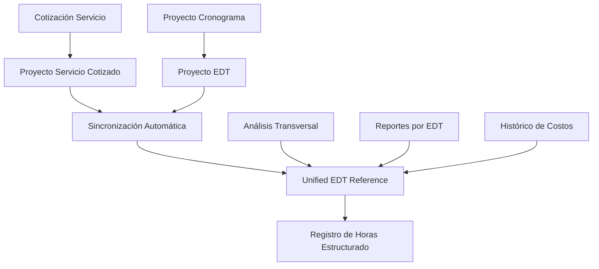

# 🔍 DIAGNÓSTICO DE CAUSA RAÍZ: SISTEMA HORAS-HOMBRE

## **PROBLEMA IDENTIFICADO: FALLA ARQUITECTÓNICA CRÍTICA**

### **❌ SITUACIÓN ACTUAL: DOBLE JERARQUÍA DESCONECTADA**

```
Cotización → Proyecto → ProyectoServicioCotizado 
                                      ↓ (categoria = EDT)
                              ProyectoEdt (categoriaServicioId = EDT)
                                      ↓
                              RegistroHoras (¿en cuál EDT?)
```

**CONFUSIÓN ARQUITECTÓNICA:** El sistema maneja **DOS jerarquías de EDTs independientes** que no están sincronizadas:

1. **EDT del Servicio**: `ProyectoServicioCotizado.categoria` (EDT original del servicio)
2. **EDT del Cronograma**: `ProyectoEdt.categoriaServicioId` (EDT del cronograma del proyecto)

### **🎯 IMPACTO EN LOS REQUERIMIENTOS DEL USUARIO**

**Lo que el usuario necesita:**
- ✅ Analizar horas por EDT (PLC, HMI, ING) a través de múltiples proyectos del 2025
- ✅ Calcular costos reales de horas-hombre por servicio  
- ✅ Resumen global y por proyecto de horas consumidas
- ✅ Base de datos histórica para futuras cotizaciones

**❌ Lo que el sistema actual permite:**
- ❌ Registro de horas ambiguo (sin EDT claro)
- ❌ No se puede vincular horas con el EDT del servicio
- ❌ Imposible hacer análisis transversal por EDT
- ❌ No hay trazabilidad de costos reales por servicio

### **🔧 EVIDENCIA TÉCNICA DEL PROBLEMA**

#### **1. API de Registro Simplificada (Wrong by Design)**
```typescript
// PROBLEMA: API que toma "cualquier servicio" sin estructura EDT
const proyectoServicio = await prisma.proyectoServicioCotizado.findFirst({
  where: { proyectoId },
  select: { id: true, nombre: true }
})
```

**❌ Falla:** No considera la estructura EDT real del servicio.

#### **2. Doble Estructura EDT sin Sincronización**
```sql
-- EDT del Servicio (desconectado)
ProyectoServicioCotizado.categoria → Edt

-- EDT del Cronograma (desconectado)  
ProyectoEdt.categoriaServicioId → Edt

-- Registro de Horas (ambiguo)
RegistroHoras.proyectoEdtId → ProyectoEdt  (opcional)
RegistroHoras.proyectoServicioId → ProyectoServicioCotizado
```

**❌ Falla:** Dos fuentes de verdad independientes.

#### **3. Wizard Confuso**
```typescript
// Wizard que propone "5 pasos" pero usa estructura de "4 niveles"
const url = '/api/proyectos'  // API correcta
const response = await fetch('/api/horas-hombre/edts-por-proyecto')  // API diferente
```

**❌ Falla:** Componentes que prometen más de lo que pueden cumplir.

### **💡 SOLUCIÓN ARQUITECTÓNICA PROPUESTA**

#### **OPCIÓN RECOMENDADA: UNIFICAR EDTs por Sincronización**

**Concepto:** Mantener ambas estructuras pero **sincronizarlas automáticamente** para garantizar que representen el mismo EDT.



#### **BENEFICIOS DE LA UNIFICACIÓN:**
- ✅ Una sola fuente de verdad para EDTs
- ✅ Análisis transversal por EDT (PLC, HMI, ING)
- ✅ Trazabilidad completa de costos
- ✅ Base histórica para cotizaciones
- ✅ Cumplimiento de los requerimientos del usuario

### **📋 IMPLEMENTACIÓN REQUERIDA**

#### **1. Corrección de APIs**
- Unificar APIs de `/api/horas-hombre/*`
- Sincronización automática de EDTs al generar proyecto
- API de registro que requiera EDT específico

#### **2. Modificación del Wizard**
- Flujo claro: Proyecto → EDT → Servicio/Actividad → Tarea
- Validación que garantice estructura EDT
- Sin opciones ambiguas

#### **3. Análisis y Reportes**
- Dashboard de horas por EDT transversal
- Comparativa planificado vs real por EDT
- Histórico para cotizaciones futuras

### **⚠️ IMPACTO DE NO ACTUAR**

Si no se corrige esta falla arquitectónica:
- ❌ **Análisis de costos imposible**
- ❌ **Planificación deficiente en cotizaciones**
- ❌ **No se puede optimizar recursos por EDT**
- ❌ **Sistema se vuelve cada vez más confuso**

### **🎯 CONCLUSIÓN**

El problema **NO es de documentación**, sino de **diseño arquitectónico**. 

La solución requiere **refactorización de la base de datos y APIs** para unificar la estructura EDT y garantizar que cada registro de horas tenga trazabilidad completa al EDT correspondiente.

**Esta es la causa raíz que explica por qué el sistema "no funciona" según los requerimientos del usuario.**