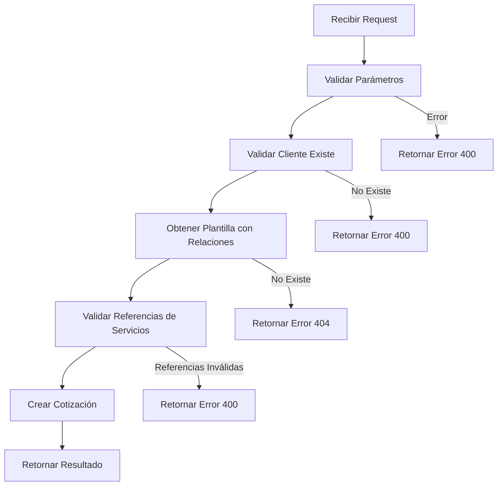

# 🔧 Solución: Error de Foreign Key Constraint al Crear Cotización desde Plantilla

## 🎯 Problema Identificado

Al intentar crear una cotización desde una plantilla, se producía el siguiente error:

```
Foreign key constraint violated: `(not available)`
```

## 🔍 Análisis del Problema

El error se originaba en la función `createCotizacionFromPlantilla` en el archivo:
`src/app/api/cotizacion/from-plantilla/route.ts`

### Causas Principales:

1. **Campos Obligatorios Faltantes**: Los campos `unidadServicioId` y `recursoId` son obligatorios (NOT NULL) en el modelo `CotizacionServicioItem`, pero no se estaban validando correctamente.

2. **Falta de Validación de Referencias**: No se verificaba que las foreign keys referenciadas (recursos, unidades de servicio) existieran en la base de datos.

3. **Orden de Validación**: Se intentaba crear la cotización antes de validar que el cliente existía.

## ✅ Solución Implementada

### 1. Validación Temprana del Cliente
```typescript
// ✅ Verificar que el cliente existe antes de continuar
const cliente = await prisma.cliente.findUnique({
  where: { id: clienteId },
})

if (!cliente) {
  return NextResponse.json({ error: 'Cliente no válido' }, { status: 400 })
}
```

### 2. Inclusión de Relaciones en la Consulta
```typescript
// ✅ Obtener plantilla con validación de foreign keys
const plantilla = await prisma.plantilla.findUnique({
  where: { id: plantillaId },
  include: {
    equipos: { include: { items: true } },
    servicios: { 
      include: { 
        items: {
          include: {
            recurso: true, // ✅ Validar que el recurso existe
            unidadServicio: true, // ✅ Validar que la unidad de servicio existe
          }
        } 
      } 
    },
    gastos: { include: { items: true } },
  },
})
```

### 3. Validación de Referencias Obligatorias
```typescript
// ✅ Validar que todos los servicios tienen recursos y unidades válidos
for (const servicio of plantilla.servicios) {
  for (const item of servicio.items) {
    if (!item.recursoId || !item.unidadServicioId) {
      return NextResponse.json({ 
        error: `El servicio '${item.nombre}' tiene referencias inválidas. Recurso: ${item.recursoId}, Unidad: ${item.unidadServicioId}` 
      }, { status: 400 })
    }
  }
}
```

### 4. Valores por Defecto para Campos Opcionales
```typescript
factorSeguridad: item.factorSeguridad || 1.0, // ✅ Valor por defecto
```

## 🛡️ Mejores Prácticas Implementadas

### 1. **Validación en Cascada**
- Validar cliente antes de procesar plantilla
- Validar plantilla antes de crear cotización
- Validar referencias de foreign keys antes de insertar

### 2. **Mensajes de Error Descriptivos**
- Identificar exactamente qué servicio tiene el problema
- Mostrar qué campos específicos están faltando
- Proporcionar contexto útil para debugging

### 3. **Inclusión de Relaciones**
- Usar `include` para validar que las relaciones existen
- Evitar errores de foreign key constraint en tiempo de ejecución

### 4. **Valores por Defecto**
- Proporcionar valores seguros para campos opcionales
- Evitar errores por campos NULL inesperados

## 🔄 Flujo de Validación Mejorado



## 🧪 Cómo Probar la Solución

1. **Navegar a una plantilla**: `/comercial/plantillas/[id]`
2. **Seleccionar un cliente** válido
3. **Hacer clic en "Crear Cotización"**
4. **Verificar** que la cotización se crea exitosamente

## 📋 Checklist de Validación

- [x] Cliente existe en la base de datos
- [x] Plantilla existe y tiene servicios
- [x] Todos los servicios tienen `recursoId` válido
- [x] Todos los servicios tienen `unidadServicioId` válido
- [x] Campos opcionales tienen valores por defecto
- [x] Mensajes de error son descriptivos

## 🚀 Próximos Pasos

1. **Implementar validaciones similares** en otras APIs que crean relaciones complejas
2. **Crear tests unitarios** para validar estos escenarios
3. **Documentar patrones** de validación para el equipo
4. **Considerar middleware** de validación para APIs críticas

---

**Autor**: Senior Django Developer & Mentor  
**Fecha**: 2025-01-20  
**Versión**: 1.0