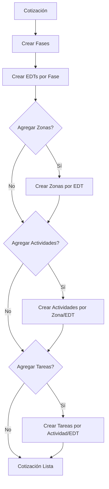
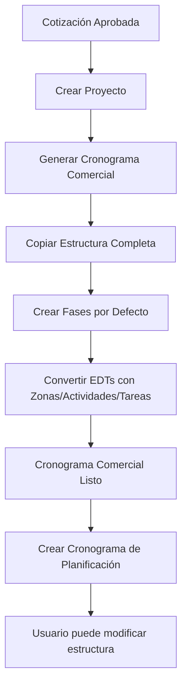
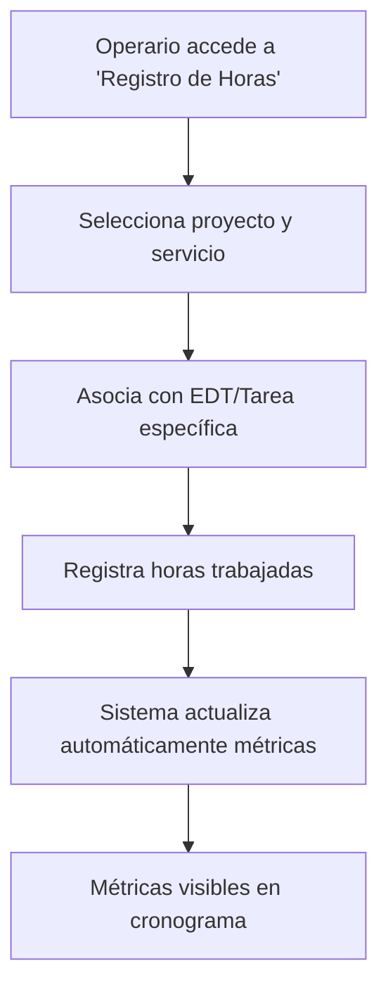

# 📊 **SISTEMA UNIFICADO DE CRONOGRAMA DE 6 NIVELES**

## 🎯 **Resumen Ejecutivo**

El **Sistema Unificado de Cronograma de 6 Niveles** revoluciona la gestión de proyectos en GYS al proporcionar una estructura jerárquica completa y consistente tanto en **cotizaciones** como en **proyectos**. Ambos sistemas utilizan exactamente **6 niveles jerárquicos** que permiten a los comerciales crear estimaciones precisas desde la cotización y a los gestores de proyecto ejecutar con control total durante la implementación.

---

## 🏗️ **JERARQUÍA UNIFICADA DE 6 NIVELES**

### **Sistema Unificado: 6 Niveles en Cotizaciones y Proyectos**

| Sistema | Niveles | Ámbito | Propósito |
|---------|---------|--------|-----------|
| **🏷️ Cotizaciones** | **6 niveles** | Área Comercial | Estimación y propuesta |
| **🏗️ Proyectos** | **6 niveles** | Gestión de Proyectos | Ejecución y control |

### **Cotizaciones y Proyectos (6 Niveles Unificados)**
```
🏢 COTIZACIÓN/PROYECTO (Contenedor principal)
    └── 📋 FASES (Planificación, Ejecución, Cierre)
        └── 🔧 EDTs (Instalación Eléctrica, etc.)
            └── 📍 ZONAS (Área Producción, Piso 5, etc.)
                └── ⚙️ ACTIVIDADES (Cableado, Iluminación, etc.)
                    └── ✅ TAREAS (Tender cableado, etc.)
```

### **Descripción de Niveles**

| Nivel | Cotizaciones | Proyectos | Descripción | Ejemplo | Responsable | Cuándo se Define |
|-------|--------------|-----------|-------------|---------|-------------|------------------|
| **Cotización/Proyecto** | ✅ | ✅ | Contenedor principal con fechas base | "Cotización ABC" / "Proyecto XYZ" | Gerente | Al crear cotización/proyecto |
| **Fase** | ✅ | ✅ | Etapas lógicas | "Planificación", "Ejecución", "Cierre" | Coordinador | En cotización o proyecto |
| **EDT** | ✅ | ✅ | Desglose técnico | "Instalación Eléctrica", "Montaje Estructural" | Técnico | En cotización |
| **Zona** | ✅ | ✅ | Ubicación específica | "Zona Norte", "Planta Industrial" | Supervisor | En cotización/proyecto |
| **Actividad** | ✅ | ✅ | Trabajo específico | "Cableado Principal", "Instalación de Transformadores" | Especialista | En cotización/proyecto |
| **Tarea** | ✅ | ✅ | Acción ejecutable | "Tender cableado principal", "Instalar transformador" | Operario | En cotización/proyecto |

### **Fechas Base del Cronograma (Cotización)**
El modelo de cotización ahora incluye **fechas de inicio y fin** que sirven como línea base temporal para todo el cronograma de 6 niveles:

- **`fechaInicio`**: Fecha de inicio planificada del proyecto/cotización
- **`fechaFin`**: Fecha de finalización planificada del proyecto/cotización

Estas fechas se definen al crear la cotización y proporcionan el marco temporal general para todas las fases, EDTs, zonas, actividades y tareas del cronograma.

---

## 🔄 **TRANSFORMACIÓN DEL CAMPO ZONA**

### **Campo Zona Actual en Cotizaciones**
- **Tipo**: Campo de texto opcional (string)
- **Ubicación**: En cada EDT de cotización
- **Propósito**: Identificar zona de trabajo
- **Ejemplo**: "Área Producción", "Piso 5", "Zona Norte"

### **Transformación a ProyectoZona**
```mermaid
graph TD
    A[Campo zona en CotizacionEdt] --> B[Conversión automática]
    B --> C[Crear ProyectoZona]
    C --> D[Propiedades completas]
    D --> E[Entidad jerárquica]

    A -->|zona: "Área Producción"| F[ProyectoZona.nombre]
    F -->|"Área Producción"| G[Con fechas, estado, etc.]
```

### **Propiedades de ProyectoZona (vs campo zona)**
| Propiedad | Campo zona (Cotización) | ProyectoZona (Proyecto) |
|-----------|-------------------------|-------------------------|
| **Tipo** | String simple | Entidad completa |
| **Fechas** | ❌ No | ✅ fechaInicioPlan, fechaFinPlan |
| **Estado** | ❌ No | ✅ planificado, en_progreso, completado |
| **Jerarquía** | ❌ No | ✅ Contiene actividades y tareas |
| **Métricas** | ❌ No | ✅ Avance, horas, etc. |

---

## 💼 **FLUJO COMERCIAL COMPLETO**

### **FASE 1: Creación de Cotización con Cronograma**

#### **1.1 Definir Estructura del Proyecto**


#### **1.2 Ejemplo Práctico: Proyecto de Instalación Eléctrica**

**Cotización/Proyecto**: "Ampliación Planta Industrial ABC"
```
📋 FASE: Ejecución
    └── 🔧 EDT: Instalación Eléctrica
        ├── 📍 ZONA: Área de Producción
        │   ├── ⚙️ ACTIVIDAD: Cableado Principal
        │   │   ├── ✅ TAREA: Tender cableado trifásico 200m
        │   │   ├── ✅ TAREA: Instalar cajas de distribución
        │   │   └── ✅ TAREA: Conectar sistema de tierra
        │   └── ⚙️ ACTIVIDAD: Iluminación Industrial
        │       ├── ✅ TAREA: Instalar luminarias LED
        │       └── ✅ TAREA: Configurar sensores de movimiento
        └── 📍 ZONA: Área Administrativa
            └── ⚙️ ACTIVIDAD: Sistema de Respaldo
                ├── ✅ TAREA: Instalar UPS principal
                └── ✅ TAREA: Configurar baterías de respaldo
```

### **FASE 2: Conversión Automática a Proyecto**

#### **2.1 Tipos de Cronogramas Generados**

| Tipo | Origen | Propósito | Editable |
|------|---------|-----------|----------|
| **Comercial** | Cotización | Baseline de referencia | ❌ No (inmutable) |
| **Planificación** | Proyecto | Plan detallado | ✅ Sí |
| **Ejecución** | Proyecto | Seguimiento real | ✅ Sí |

#### **2.2 Proceso de Conversión**


### **FASE 3: Gestión Durante la Ejecución**

#### **3.1 Registro de Horas Hombre - Módulo Independiente**
El sistema utiliza un **módulo de registro de horas independiente** que se integra automáticamente con el cronograma de 6 niveles:

##### **Módulo de Registro de Horas (Principal)**


**Características del Módulo:**
- **Independiente**: Funciona fuera del cronograma
- **Asociación inteligente**: Vincula horas con elementos del cronograma
- **Campos principales**:
  - Proyecto y servicio específico
  - Fecha del trabajo
  - Horas trabajadas
  - Descripción detallada
  - Asociación con EDT/Tarea (opcional)

##### **Integración con Cronograma de 6 Niveles**
- **Asociación automática**: Horas registradas se vinculan a EDTs, Zonas, Actividades o Tareas
- **Cálculo automático**: Métricas se actualizan en tiempo real
- **Visibilidad**: Horas aparecen en el cronograma sin duplicar interfaces

##### **Niveles de Registro según Granularidad**
| Escenario | Nivel de Registro | Ejemplo | Beneficio |
|-----------|------------------|---------|-----------|
| **Proyecto detallado** | **Tarea específica** | "Instalar luminaria LED #15" | Seguimiento preciso |
| **Proyecto estándar** | **Actividad** | "Iluminación Industrial" | Balance eficiencia |
| **Proyecto básico** | **EDT** | "Instalación Eléctrica" | Simplicidad operativa |

##### **Cálculo Automático de Métricas**
```typescript
// Ejemplo de cálculo automático
horasRealesTotal = suma(horasRegistradas)
eficiencia = (horasPlan / horasReales) * 100
productividad = horasReales / diasTrabajados
avanceReal = (tareasCompletadas / tareasTotal) * 100
desviacion = ((horasReales - horasPlan) / horasPlan) * 100
```

##### **Visualización de Horas en el Cronograma**
```
┌─ ACTIVIDAD: Cableado Principal ──────────────────┐
│ 🎯 Estado: En Progreso (65% completado)          │
│ ⏱️ Horas Plan: 40h    ⏱️ Horas Real: 28h        │
│ 📈 Eficiencia: 140%   📊 Productividad: 7h/día   │
│                                                   │
│ 📝 Últimos Registros de Horas:                   │
│ ┌─────────────────────────────────────────────┐   │
│ │ 📅 01/10: 6h - Tender cableado inicial     │   │
│ │ 📅 02/10: 8h - Continuación cableado       │   │
│ │ 📅 03/10: 7h - Conexiones intermedias      │   │
│ │ 📅 04/10: 7h - Pruebas y ajustes           │   │
│ └─────────────────────────────────────────────┘   │
│                                                   │
│ 🔗 Ver todos los registros →                     │
└───────────────────────────────────────────────────┘
```

**Nota**: Las horas se registran desde el **Módulo de Registro de Horas** independiente, pero se visualizan automáticamente en el cronograma.

##### **Beneficios del Registro de Horas**
- **📊 Métricas en tiempo real**: Eficiencia, productividad, desviaciones
- **📈 Seguimiento preciso**: Plan vs Real por actividad/tarea
- **👥 Accountability**: Responsables saben exactamente qué hicieron
- **💰 Control de costos**: Horas reales vs presupuestadas
- **📋 Reportes automáticos**: Para stakeholders y gestión

#### **3.2 Beneficios para Seguimiento**
- **Visibilidad total**: Desde ejecutivo hasta operario
- **Flexibilidad**: Diferentes niveles de detalle por proyecto
- **Precisión**: Métricas calculadas automáticamente
- **Comparación**: Plan vs Real en tiempo real

---

## 🎨 **INTERFAZ COMERCIAL INTUITIVA**

### **Creación de Cotización con Cronograma**

#### **Paso 1: Definir Fases del Proyecto**
```
┌─ NUEVA COTIZACIÓN ──────────────────────────────┐
│ Proyecto: Ampliación Planta Industrial ABC     │
│                                                │
│ 📋 FASES DEL PROYECTO                          │
│ ┌─────────────────────────────────────────────┐ │
│ │ ➕ Agregar Fase                            │ │
│ │                                             │ │
│ │ 📋 Planificación (20%)                     │ │
│ │ 📋 Ejecución (60%)                         │ │
│ │ 📋 Cierre (20%)                            │ │
│ └─────────────────────────────────────────────┘ │
└─────────────────────────────────────────────────┘
```

#### **Paso 2: Crear EDTs por Fase**
```
┌─ EDTs - FASE: EJECUCIÓN ──────────────────────┐
│ ➕ Nuevo EDT                                   │
│                                               │
│ 🔧 Instalación Eléctrica                      │
│    ├── 📍 Zona: Área Producción               │
│    │   ├── 🎯 Cableado Principal              │
│    │   │   ├── ✅ Tender cableado 200m        │
│    │   │   └── ✅ Instalar cajas distribución │
│    │   └── 🎯 Iluminación Industrial          │
│    │       └── ✅ Instalar luminarias LED     │
│    └── 📍 Zona: Área Administrativa           │
│        └── 🎯 Sistema Respaldo                │
│            └── ✅ Instalar UPS                │
└───────────────────────────────────────────────┘
```

### **Vista de Proyecto con Cronogramas**

#### **Selector de Cronogramas**
```
┌─ CRONOGRAMAS DEL PROYECTO ────────────────────┐
│ 📊 Métricas Generales                         │
│ • Total EDTs: 15    • Completado: 35%        │
│ • Horas Plan: 1,200 • Horas Real: 420        │
│                                               │
│ 🟦 Cronograma Comercial (Baseline)            │
│ 🟪 Cronograma de Planificación [ACTIVO]       │
│ 🟩 Cronograma de Ejecución                    │
│                                               │
│ 🔄 Copiar entre cronogramas                   │
└───────────────────────────────────────────────┘
```

---

## 📈 **BENEFICIOS COMERCIALES**

### **Para el Área Comercial**

#### **1. Estimaciones Más Precisas**
- **Estructura jerárquica**: Desglose detallado desde el inicio
- **Flexibilidad**: Adaptar nivel de detalle según proyecto
- **Referencia histórica**: Comparar con proyectos similares

#### **2. Mejor Comunicación con Clientes**
- **Transparencia**: Mostrar estructura completa del trabajo
- **Confianza**: Cronogramas realistas y detallados
- **Negociación**: Ajustes precisos por zona/actividad

#### **3. Ventaja Competitiva**
- **Profesionalismo**: Cronogramas de nivel empresarial
- **Diferenciación**: Más detallado que competidores
- **Valor agregado**: Servicio completo de planificación

### **Para la Gestión de Proyectos**

#### **1. Control Total del Alcance**
- **Visibilidad completa**: Desde fases hasta tareas
- **Flexibilidad**: Adaptar según complejidad del proyecto
- **Escalabilidad**: Crecer con el proyecto

#### **2. Seguimiento Preciso**
- **Métricas automáticas**: Avance, eficiencia, desviaciones
- **Registro flexible**: Horas en el nivel apropiado
- **Reportes avanzados**: Dashboards ejecutivos

#### **3. Integración con Herramientas**
- **MS Project**: Exportación/importación bidireccional
- **Excel/CSV**: Reportes para stakeholders
- **APIs abiertas**: Integración con otros sistemas

---

## 🔄 **INTEGRACIÓN CON PROCESOS EXISTENTES**

### **Compatibilidad con Sistema Actual**
- ✅ **Datos existentes**: Sin pérdida de información
- ✅ **URLs actuales**: Mismas rutas de acceso
- ✅ **Permisos**: Sistema de roles intacto
- ✅ **APIs**: Endpoints backward compatible

### **Migración Transparente**
- 🔄 **Conversión automática**: Cotizaciones → Proyectos
- 📊 **Datos históricos**: Accesibles en nuevo formato
- 👥 **Capacitación mínima**: Interfaz intuitiva
- 🛡️ **Backup completo**: Seguridad de datos garantizada

---

## 📋 **CASOS DE USO COMERCIALES**

### **Caso 1: Proyecto Industrial Complejo**
**Cliente**: Planta Manufacturera (5 zonas de producción)
```
Proyecto: Modernización Línea de Producción
├── Fase: Planificación
├── Fase: Ejecución
│   ├── EDT: Instalaciones Eléctricas
│   │   ├── Zona: Línea A
│   │   │   ├── Actividad: Cableado
│   │   │   └── Actividad: Iluminación
│   │   ├── Zona: Línea B
│   │   └── Zona: Línea C
│   └── EDT: Automatización
└── Fase: Puesta en Marcha
```

### **Caso 2: Proyecto de Construcción**
**Cliente**: Edificio Corporativo (Múltiples pisos)
```
Proyecto: Construcción Edificio ABC
├── Fase: Estructura
├── Fase: Instalaciones
│   ├── EDT: Eléctrica
│   │   ├── Zona: Piso 1-5
│   │   ├── Zona: Piso 6-10
│   │   └── Zona: Piso 11-15
│   └── EDT: HVAC
└── Fase: Acabados
```

### **Caso 3: Proyecto Simple**
**Cliente**: Oficina Administrativa (Proyecto básico)

#### **Cotización/Proyecto (6 niveles unificados)**
```
🏢 Cotización/Proyecto: Remodelación Oficina
├── 📋 Fase: Planificación
├── 📋 Fase: Ejecución
│   └── 🔧 EDT: Instalación Eléctrica
│       ├── 📍 Zona: Oficina Principal
│       │   └── ⚙️ Actividad: Cableado y Conexiones
│       │       ├── ✅ Tarea: Instalar tomas eléctricas
│       │       └── ✅ Tarea: Configurar iluminación
│       └── 🔧 EDT: Pintura y Acabados
└── 📋 Fase: Cierre
```
*Nota: La estructura completa de 6 niveles está disponible tanto en cotizaciones como en proyectos*

---

## 🎯 **IMPLEMENTACIÓN RECOMENDADA**

### **Fases de Implementación**
1. **Fase 1 (2 semanas)**: Schema de BD y APIs básicas
2. **Fase 2 (5 semanas)**: Componentes UI y lógica de negocio
3. **Fase 3 (3 semanas)**: Sistema de dependencias y MS Project
4. **Fase 4 (2 semanas)**: Testing, migración y documentación

### **Equipo Recomendado**
- **1 Arquitecto Senior**: Diseño técnico
- **2 Desarrolladores Full-Stack**: Implementación
- **1 QA Engineer**: Testing y validación
- **1 Product Owner**: Validación comercial

### **Presupuesto Aproximado**
- **Desarrollo**: $20,000 USD (3-4 desarrolladores × 10-12 semanas)
- **Testing**: $5,000 USD (QA Engineer + herramientas open source)
- **Total**: **$25,000 USD** (100% open source - sin costos de licencias)
- **Tecnologías**: Next.js, React, Prisma, PostgreSQL, librerías open source

---

## 🚀 **PRÓXIMOS PASOS**

### **Para Iniciar la Implementación**
1. ✅ **Aprobar alcance** y requerimientos específicos
2. ✅ **Asignar equipo** de desarrollo
3. ✅ **Definir timeline** de 12 semanas
4. ✅ **Iniciar con prototipo** de UI para validación

### **Beneficios Inmediatos**
- 📈 **Mejores cotizaciones** con estructura detallada
- 👥 **Mayor satisfacción** del cliente con transparencia
- 📊 **Mejor control** de proyectos en ejecución
- 🏆 **Ventaja competitiva** en el mercado

---

## 📞 **SOPORTE Y CONTACTO**

### **Equipo de Desarrollo**
- **Arquitecto**: Sistema de IA Mejorado
- **Coordinador**: Equipo GYS Proyectos
- **Timeline**: 12 semanas implementación
- **Presupuesto**: $25,000 USD

### **Documentación Técnica**
- **[Especificaciones Técnicas](./CRONOGRAMA_6_NIVELES_TECNICO.md)**
- **[Guía de Usuario](./CRONOGRAMA_6_NIVELES_USUARIO.md)**
- **[API Documentation](./CRONOGRAMA_6_NIVELES_API.md)**

---

## ⚠️ **NOTAS IMPORTANTES**

### **Compatibilidad Total**
- ✅ **Cotizaciones**: Jerarquía completa de 6 niveles
- ✅ **Proyectos**: Jerarquía completa de 6 niveles
- ✅ **Migración**: Automática y transparente
- ✅ **Datos**: Sin pérdida de información histórica

### **Diferenciación Estratégica**
| Aspecto | Cotizaciones | Proyectos |
|---------|-------------|-----------|
| **Propósito** | Estimación comercial precisa | Ejecución operativa detallada |
| **Usuarios** | Área comercial | Gestores de proyecto |
| **Complejidad** | Detallado y preciso | Detallado y completo |
| **Jerarquía** | 6 niveles unificados | 6 niveles unificados |
| **Herramientas** | Interfaz completa | MS Project, dependencias |
| **Estado** | Editable durante cotización | Editable durante ejecución |

### **Beneficio para GYS**
- **Comerciales**: Mayor agilidad en cotizaciones
- **Proyectos**: Control total de ejecución
- **Empresa**: Mejor competitividad general

---

**📅 Fecha**: 3 de octubre de 2025
**👥 Autor**: Sistema de IA Mejorado - Arquitectura Unificada
**📊 Versión**: 2.2 - Sistema Unificado de 6 Niveles (Cotizaciones y Proyectos)