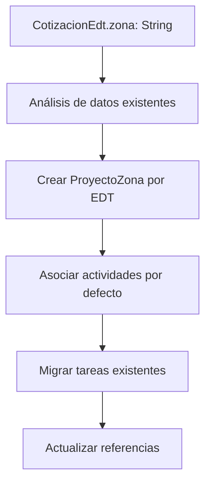

# 📋 **FASE 1: Schema de BD y APIs Básicas**
## Sistema de Cronograma de 6 Niveles - Especificaciones Técnicas

---

## 🎯 **OBJETIVOS DE LA FASE 1**

**Duración**: 2 semanas
**Responsable**: Arquitecto Senior + 1 Desarrollador

### **Alcance**
- ✅ Diseño y creación de modelos de BD para jerarquía completa de 6 niveles
- ✅ Implementación de APIs REST básicas (CRUD completo)
- ✅ Sistema de migración automática de datos existentes
- ✅ Configuración de relaciones y validaciones
- ✅ Tests unitarios de APIs

---

## 🏗️ **JERARQUÍA COMPLETA DE MODELOS**

### **Sistema Dual: Cotizaciones (4 niveles) + Proyectos (6 niveles)**

```
🏢 PROYECTO (común)
    └── 📋 FASE (común)
        └── 🔧 EDT (común)
            ├── zona: String (cotizaciones) ← transformación → 📍 ZONA (proyectos)
            └── ✅ TAREA (común)
                └── 🎯 ACTIVIDAD (solo proyectos)
                    └── ✅ SUBTAREA (solo proyectos)
```

---

## 📊 **NUEVOS MODELOS DE BASE DE DATOS**

### **1. ProyectoZona**
```prisma
model ProyectoZona {
  id                   String  @id @default(cuid())
  proyectoId           String
  proyectoEdtId        String
  nombre               String  // ej: "Área Producción", "Piso 5"

  // Fechas planificadas
  fechaInicioPlan      DateTime?
  fechaFinPlan         DateTime?
  fechaInicioReal      DateTime?
  fechaFinReal         DateTime?

  // Estado y progreso
  estado               EstadoZona @default(planificado)
  porcentajeAvance     Int        @default(0)

  // Métricas calculadas
  horasPlan            Decimal?  @default(0) @db.Decimal(10, 2)
  horasReales          Decimal   @default(0) @db.Decimal(10, 2)

  // Auditoría
  createdAt            DateTime @default(now())
  updatedAt            DateTime @updatedAt

  // Relaciones
  proyecto             Proyecto             @relation(fields: [proyectoId], references: [id], onDelete: Cascade)
  proyectoEdt          ProyectoEdt         @relation(fields: [proyectoEdtId], references: [id], onDelete: Cascade)
  actividades          ProyectoActividad[]

  @@unique([proyectoId, proyectoEdtId, nombre])
  @@index([proyectoId, proyectoEdtId])
  @@map("proyecto_zona")
}
```

### **2. ProyectoActividad**
```prisma
model ProyectoActividad {
  id                   String  @id @default(cuid())
  proyectoZonaId       String
  proyectoCronogramaId String
  nombre               String  // ej: "Cableado Principal", "Iluminación Industrial"

  // Fechas planificadas
  fechaInicioPlan      DateTime
  fechaFinPlan         DateTime
  fechaInicioReal      DateTime?
  fechaFinReal         DateTime?

  // Estado y progreso
  estado               EstadoActividad @default(pendiente)
  porcentajeAvance     Int             @default(0)

  // Métricas calculadas
  horasPlan            Decimal? @db.Decimal(10, 2)
  horasReales          Decimal  @default(0) @db.Decimal(10, 2)

  // Campos adicionales
  descripcion          String?
  prioridad            PrioridadEdt @default(media)

  // Auditoría
  createdAt            DateTime @default(now())
  updatedAt            DateTime @updatedAt

  // Relaciones
  proyectoZona         ProyectoZona    @relation(fields: [proyectoZonaId], references: [id], onDelete: Cascade)
  proyectoCronograma   ProyectoCronograma @relation(fields: [proyectoCronogramaId], references: [id], onDelete: Cascade)
  tareas               ProyectoTarea[]

  @@index([proyectoZonaId, proyectoCronogramaId])
  @@map("proyecto_actividad")
}
```

### **3. ProyectoTarea (Extendido)**
```prisma
model ProyectoTarea {
  id                   String @id @default(cuid())
  proyectoEdtId        String
  proyectoCronogramaId String // ✅ Referencia al tipo de cronograma
  proyectoActividadId  String? // ✅ Nueva relación opcional

  // Información básica
  nombre      String
  descripcion String?

  // Fechas planificadas
  fechaInicio DateTime
  fechaFin    DateTime

  // Fechas reales
  fechaInicioReal DateTime?
  fechaFinReal    DateTime?

  // Horas (estimadas vs reales desde RegistroHoras)
  horasEstimadas Decimal? @db.Decimal(10, 2)
  horasReales    Decimal  @default(0) @db.Decimal(10, 2) // Calculado automáticamente

  // Estado y prioridad
  estado               EstadoTarea    @default(pendiente)
  prioridad            PrioridadTarea @default(media)
  porcentajeCompletado Int            @default(0)

  // Dependencias
  dependenciaId String?

  // Asignaciones
  responsableId String?

  // ✅ NUEVO: Registros de horas asociados
  registrosHoras RegistroHoras[]

  // Funcionalidades avanzadas
  subtareas               ProyectoSubtarea[]
  dependenciasOrigen      ProyectoDependenciaTarea[] @relation("ProyectoTareaOrigen")
  dependenciasDependiente ProyectoDependenciaTarea[] @relation("ProyectoTareaDependiente")

  // Auditoría
  createdAt DateTime @default(now())
  updatedAt DateTime @updatedAt

  // Relaciones
  proyectoEdt        ProyectoEdt        @relation(fields: [proyectoEdtId], references: [id], onDelete: Cascade)
  proyectoCronograma ProyectoCronograma @relation(fields: [proyectoCronogramaId], references: [id], onDelete: Cascade)
  proyectoActividad  ProyectoActividad? @relation(fields: [proyectoActividadId], references: [id], onDelete: SetNull)
  dependencia        ProyectoTarea?     @relation("ProyectoTareaDependencia", fields: [dependenciaId], references: [id], onDelete: SetNull)
  tareasDependientes ProyectoTarea[]    @relation("ProyectoTareaDependencia")
  responsable        User?              @relation("ProyectoTareaResponsable", fields: [responsableId], references: [id], onDelete: SetNull)

  @@index([proyectoEdtId, estado])
  @@index([responsableId, fechaFin])
  @@index([dependenciaId])
  @@index([proyectoActividadId]) // ✅ Nuevo índice
  @@map("proyecto_tarea")
}
```

### **4. ProyectoSubtarea (Extendido)**
```prisma
model ProyectoSubtarea {
  id                   String      @id @default(cuid())
  nombre               String
  descripcion          String?
  fechaInicio          DateTime
  fechaFin             DateTime
  fechaInicioReal      DateTime?
  fechaFinReal         DateTime?
  estado               EstadoTarea @default(pendiente)
  porcentajeCompletado Int         @default(0)
  horasEstimadas       Decimal?    @db.Decimal(10, 2)
  horasReales          Decimal?    @default(0) @db.Decimal(10, 2)

  // Relación con tarea padre
  proyectoTareaId String
  proyectoTarea   ProyectoTarea @relation(fields: [proyectoTareaId], references: [id], onDelete: Cascade)

  // Asignado
  asignadoId String?
  asignado   User?   @relation("ProyectoSubtareaAsignado", fields: [asignadoId], references: [id], onDelete: SetNull)

  createdAt DateTime @default(now())
  updatedAt DateTime @updatedAt

  @@map("proyecto_subtarea")
}
```

### **5. ProyectoDependenciaTarea**
```prisma
model ProyectoDependenciaTarea {
  id   String          @id @default(cuid())
  tipo TipoDependencia @default(finish_to_start)

  // Tarea origen (predecesora)
  tareaOrigenId String
  tareaOrigen   ProyectoTarea @relation("ProyectoTareaOrigen", fields: [tareaOrigenId], references: [id], onDelete: Cascade)

  // Tarea dependiente (sucesora)
  tareaDependienteId String
  tareaDependiente   ProyectoTarea @relation("ProyectoTareaDependiente", fields: [tareaDependienteId], references: [id], onDelete: Cascade)

  createdAt DateTime @default(now())

  @@unique([tareaOrigenId, tareaDependienteId])
  @@map("proyecto_dependencias_tarea")
}
```

---

## 🔄 **MIGRACIÓN DE DATOS EXISTENTES**

### **Estrategia de Migración**


### **Script de Migración**
```typescript
// migration-script.ts
async function migrateExistingData() {
  // 1. Obtener todos los EDTs con zona definida
  const edtsWithZona = await prisma.cotizacionEdt.findMany({
    where: { zona: { not: null } },
    include: { proyectoEdt: true }
  });

  // 2. Crear ProyectoZona para cada zona única
  for (const edt of edtsWithZona) {
    if (edt.zona && edt.proyectoEdt) {
      const zonaExistente = await prisma.proyectoZona.findFirst({
        where: {
          proyectoId: edt.proyectoEdt.proyectoId,
          proyectoEdtId: edt.proyectoEdt.id,
          nombre: edt.zona
        }
      });

      if (!zonaExistente) {
        await prisma.proyectoZona.create({
          data: {
            proyectoId: edt.proyectoEdt.proyectoId,
            proyectoEdtId: edt.proyectoEdt.id,
            nombre: edt.zona,
            // Copiar fechas del EDT
            fechaInicioPlan: edt.proyectoEdt.fechaInicioPlan,
            fechaFinPlan: edt.proyectoEdt.fechaFinPlan,
            horasPlan: edt.proyectoEdt.horasPlan
          }
        });
      }
    }
  }

  // 3. Crear actividades por defecto
  const zonasCreadas = await prisma.proyectoZona.findMany();
  for (const zona of zonasCreadas) {
    await prisma.proyectoActividad.create({
      data: {
        proyectoZonaId: zona.id,
        proyectoCronogramaId: zona.proyectoEdt.proyectoCronogramaId,
        nombre: `Actividad Principal - ${zona.nombre}`,
        fechaInicioPlan: zona.fechaInicioPlan,
        fechaFinPlan: zona.fechaFinPlan,
        horasPlan: zona.horasPlan
      }
    });
  }
}
```

---

## 🔌 **APIS REST - ESPECIFICACIONES COMPLETAS**

### **1. API de Zonas**

#### **GET /api/proyectos/[proyectoId]/zonas**
```typescript
// Respuesta
{
  "success": true,
  "data": [
    {
      "id": "string",
      "proyectoId": "string",
      "proyectoEdtId": "string",
      "nombre": "Área Producción",
      "estado": "planificado",
      "porcentajeAvance": 0,
      "fechaInicioPlan": "2025-01-01T00:00:00.000Z",
      "fechaFinPlan": "2025-12-31T00:00:00.000Z",
      "horasPlan": 100.00,
      "horasReales": 0.00,
      "actividadesCount": 3,
      "createdAt": "2025-01-01T00:00:00.000Z"
    }
  ]
}
```

#### **POST /api/proyectos/[proyectoId]/zonas**
```typescript
// Request
{
  "proyectoEdtId": "string",
  "nombre": "Nueva Zona",
  "fechaInicioPlan": "2025-01-01T00:00:00.000Z",
  "fechaFinPlan": "2025-12-31T00:00:00.000Z",
  "horasPlan": 50.00
}

// Respuesta
{
  "success": true,
  "data": { /* objeto ProyectoZona completo */ }
}
```

#### **PUT /api/proyectos/[proyectoId]/zonas/[zonaId]**
#### **DELETE /api/proyectos/[proyectoId]/zonas/[zonaId]**

### **2. API de Actividades**

#### **GET /api/proyectos/[proyectoId]/actividades**
```typescript
// Query parameters
{
  zonaId?: string,
  cronogramaId?: string,
  estado?: EstadoActividad,
  fechaDesde?: string,
  fechaHasta?: string
}
```

#### **POST /api/proyectos/[proyectoId]/actividades**
```typescript
// Request
{
  "proyectoZonaId": "string",
  "proyectoCronogramaId": "string",
  "nombre": "Cableado Principal",
  "descripcion": "Instalación completa del sistema de cableado",
  "fechaInicioPlan": "2025-01-01T00:00:00.000Z",
  "fechaFinPlan": "2025-01-15T00:00:00.000Z",
  "horasPlan": 40.00,
  "prioridad": "alta"
}
```

### **3. API de Tareas (Extendida)**

#### **GET /api/proyectos/[proyectoId]/tareas**
```typescript
// Query parameters extendidos
{
  zonaId?: string,
  actividadId?: string,
  cronogramaId?: string,
  responsableId?: string,
  estado?: EstadoTarea,
  prioridad?: PrioridadTarea,
  fechaDesde?: string,
  fechaHasta?: string,
  tieneDependencias?: boolean
}
```

#### **POST /api/proyectos/[proyectoId]/tareas**
```typescript
// Request extendido
{
  "proyectoEdtId": "string",
  "proyectoCronogramaId": "string",
  "proyectoActividadId": "string", // Opcional - nuevo campo
  "nombre": "Tender cableado trifásico",
  "descripcion": "Instalación de cableado de 200 metros",
  "fechaInicio": "2025-01-01T00:00:00.000Z",
  "fechaFin": "2025-01-05T00:00:00.000Z",
  "horasEstimadas": 16.00,
  "prioridad": "media",
  "responsableId": "user-id",
  "dependenciaId": "tarea-anterior-id" // Opcional
}
```

### **4. API de Dependencias**

#### **GET /api/proyectos/[proyectoId]/dependencias**
```typescript
// Respuesta
{
  "success": true,
  "data": [
    {
      "id": "string",
      "tipo": "finish_to_start",
      "tareaOrigen": {
        "id": "string",
        "nombre": "Tender cableado"
      },
      "tareaDependiente": {
        "id": "string",
        "nombre": "Instalar cajas de distribución"
      }
    }
  ]
}
```

#### **POST /api/proyectos/[proyectoId]/dependencias**
```typescript
// Request
{
  "tareaOrigenId": "string",
  "tareaDependienteId": "string",
  "tipo": "finish_to_start"
}
```

---

## ✅ **VALIDACIONES Y REGLAS DE NEGOCIO**

### **Validaciones de Zona**
```typescript
const zonaValidations = {
  nombre: {
    required: true,
    minLength: 2,
    maxLength: 100,
    unique: ['proyectoId', 'proyectoEdtId'] // Única por EDT en proyecto
  },
  fechas: {
    fechaInicioPlan: { required: true },
    fechaFinPlan: { required: true, after: 'fechaInicioPlan' }
  },
  horas: {
    horasPlan: { min: 0, max: 9999.99 }
  }
};
```

### **Validaciones de Actividad**
```typescript
const actividadValidations = {
  nombre: {
    required: true,
    minLength: 3,
    maxLength: 200
  },
  fechas: {
    required: true,
    dentroDeZona: true, // Debe estar dentro de las fechas de la zona
    coherentes: true
  },
  asociacion: {
    zonaRequerida: true,
    cronogramaRequerido: true
  }
};
```

### **Validaciones de Dependencias**
```typescript
const dependenciaValidations = {
  noCiclos: true, // Evitar dependencias circulares
  mismaActividad: false, // No dependencias dentro de la misma actividad
  fechasCoherentes: true, // Validar lógica temporal
  maxDependencias: 10 // Máximo 10 dependencias por tarea
};
```

---

## 🧪 **TESTS UNITARIOS - ESTRUCTURA**

### **Tests de Modelos**
```typescript
// tests/models/proyecto-zona.test.ts
describe('ProyectoZona Model', () => {
  test('should create zona with valid data', async () => {
    const zona = await ProyectoZona.create({
      proyectoId: 'proj-1',
      proyectoEdtId: 'edt-1',
      nombre: 'Área Producción'
    });

    expect(zona.nombre).toBe('Área Producción');
    expect(zona.estado).toBe('planificado');
  });

  test('should enforce unique constraint', async () => {
    await expect(ProyectoZona.create({
      proyectoId: 'proj-1',
      proyectoEdtId: 'edt-1',
      nombre: 'Área Producción' // Ya existe
    })).rejects.toThrow();
  });
});
```

### **Tests de APIs**
```typescript
// tests/api/zonas.test.ts
describe('Zonas API', () => {
  test('GET /api/proyectos/:id/zonas - should return zonas list', async () => {
    const response = await request(app)
      .get('/api/proyectos/proj-1/zonas')
      .expect(200);

    expect(response.body.success).toBe(true);
    expect(Array.isArray(response.body.data)).toBe(true);
  });

  test('POST /api/proyectos/:id/zonas - should create zona', async () => {
    const response = await request(app)
      .post('/api/proyectos/proj-1/zonas')
      .send({
        proyectoEdtId: 'edt-1',
        nombre: 'Nueva Zona'
      })
      .expect(201);

    expect(response.body.data.nombre).toBe('Nueva Zona');
  });
});
```

---

## 📋 **CHECKLIST DE FASE 1**

### **Semana 1: Diseño y Modelos**
- [ ] Diseño completo de schema de BD
- [ ] Creación de modelos Prisma
- [ ] Definición de relaciones y constraints
- [ ] Diseño de APIs REST
- [ ] Creación de validaciones
- [ ] Diseño de script de migración

### **Semana 2: Implementación y Testing**
- [ ] Implementación de modelos en BD
- [ ] Creación de APIs CRUD básicas
- [ ] Implementación de validaciones
- [ ] Desarrollo de script de migración
- [ ] Tests unitarios completos
- [ ] Documentación técnica
- [ ] Code review y ajustes

---

## 🎯 **ENTREGABLES DE FASE 1**

### **Código**
- ✅ Schema de Prisma actualizado
- ✅ APIs REST implementadas
- ✅ Script de migración funcional
- ✅ Tests unitarios (cobertura > 80%)

### **Documentación**
- ✅ Especificaciones técnicas detalladas
- ✅ Diagramas de BD y APIs
- ✅ Guía de migración
- ✅ Manual de testing

### **Validación**
- ✅ Datos de prueba migrados correctamente
- ✅ APIs funcionales y probadas
- ✅ Compatibilidad backward garantizada
- ✅ Performance aceptable

---

## 🚀 **SIGUIENTE PASO: INICIAR IMPLEMENTACIÓN**

¿Procedo con la **implementación del schema de Prisma** y las **APIs básicas**, o necesitas revisar/ajustar alguna especificación antes de comenzar?