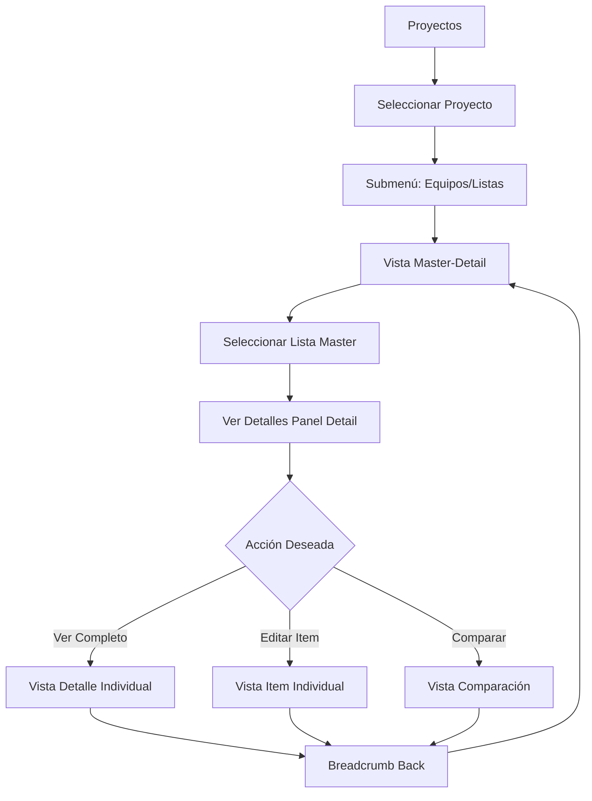

# 🧭 GUÍA DE NAVEGACIÓN - SISTEMA MASTER-DETAIL

## 📋 Cómo Acceder a las Nuevas Funcionalidades

### 🚀 Navegación Principal

#### 1. **Acceso desde el Menú Principal**
- Ve a **Proyectos** en el sidebar izquierdo
- Selecciona cualquier proyecto de la lista
- Una vez dentro del proyecto, verás el **submenú de navegación**

#### 2. **Submenú de Proyectos**
El submenú horizontal incluye estas secciones:

| Sección | Ruta | Descripción |
|---------|------|-------------|
| **Proyecto** | `/proyectos/[id]` | Vista general del proyecto |
| **Equipos** | `/proyectos/[id]/equipos` | 🆕 **Vista Master-Detail de Listas** |
| **Listas** | `/proyectos/[id]/equipos` | 🆕 **Mismo que Equipos (Master-Detail)** |
| **Comparación** | `/proyectos/[id]/equipos/comparacion` | Comparar cotizaciones |
| **Pedidos** | `/proyectos/[id]/equipos/pedidos` | Gestión de pedidos |
| **Requerimientos** | `/proyectos/[id]/requerimientos` | Documentos técnicos |
| **Valorizaciones** | `/proyectos/[id]/gestion/valorizaciones` | Control financiero |
| **Horas Hombre** | `/proyectos/[id]/gestion/horas` | Registro de tiempo |

---

## 🎯 Vista Master-Detail de Listas de Equipos

### 📍 URL Principal
```
/proyectos/[id]/equipos
```

### 🔍 Características de la Vista Master

#### **Panel Izquierdo (Master)**
- **Lista de todas las listas de equipos** del proyecto
- **Filtros avanzados**: por estado, responsable, fecha
- **Búsqueda en tiempo real** por nombre o descripción
- **Vista de tarjetas o tabla** (toggle)
- **Estadísticas en tiempo real**: total listas, items, valor
- **Acciones rápidas**: crear, editar, eliminar

#### **Panel Derecho (Detail)**
- **Detalles completos** de la lista seleccionada
- **Items de la lista** con información técnica
- **Cotizaciones asociadas** y comparaciones
- **Historial de cambios** y auditoría
- **Acciones contextuales** según permisos

---

## 🎮 Cómo Usar el Sistema

### 1. **Navegación Básica**

#### Paso 1: Acceder a la Vista Master
```
1. Sidebar → Proyectos
2. Seleccionar proyecto
3. Click en "Equipos" o "Listas" en el submenú
```

#### Paso 2: Explorar las Listas (Master)
- **Ver todas las listas** en el panel izquierdo
- **Filtrar por estado**: Borrador, En Proceso, Completada
- **Buscar por nombre**: Usar el campo de búsqueda
- **Cambiar vista**: Toggle entre tarjetas y tabla

#### Paso 3: Ver Detalles (Detail)
- **Click en cualquier lista** del panel Master
- **Ver detalles completos** en el panel Detail
- **Navegar entre tabs**: Información, Items, Cotizaciones, Historial

### 2. **Navegación a Vista Detalle Completa**

#### URL de Detalle Individual
```
/proyectos/[id]/equipos/[listaId]
```

#### Cómo Acceder:
1. **Desde Master-Detail**: Click en "Ver Detalles" en el panel Detail
2. **Desde acciones**: Menú de 3 puntos → "Ver Detalles"
3. **URL directa**: Navegar directamente a la URL

### 3. **Navegación a Items Específicos**

#### URL de Item Individual
```
/proyectos/[id]/equipos/[listaId]/detalle/[itemId]
```

#### Cómo Acceder:
1. **Desde vista detalle**: Click en cualquier item de la tabla
2. **Desde Master-Detail**: Click en item en el panel Detail
3. **Breadcrumb navigation**: Usar las migas de pan

---

## 🔄 Flujo de Navegación Completo

### **Flujo Típico de Usuario**



### **Breadcrumb Navigation**
En todas las vistas detalle encontrarás navegación de migas:

```
Proyectos > [Nombre Proyecto] > Equipos > [Nombre Lista] > [Item]
```

---

## 🎨 Características UX/UI

### **Responsive Design**
- **Desktop**: Master-Detail lado a lado
- **Tablet**: Master-Detail apilado
- **Mobile**: Navegación por tabs

### **Animaciones Fluidas**
- **Transiciones suaves** entre vistas
- **Loading skeletons** durante carga
- **Hover effects** en elementos interactivos
- **Stagger animations** en listas

### **Estados Visuales**
- **Loading states**: Skeletons y spinners
- **Empty states**: Mensajes informativos
- **Error states**: Manejo graceful de errores
- **Success feedback**: Confirmaciones visuales

---

## 🔧 Funcionalidades Avanzadas

### **Filtros y Búsqueda**
- **Filtros múltiples**: Estado, responsable, fecha, valor
- **Búsqueda en tiempo real**: Debounced search
- **Filtros persistentes**: Se mantienen en navegación
- **Reset rápido**: Limpiar todos los filtros

### **Acciones Contextuales**
- **Menús de 3 puntos**: Acciones por item
- **Acciones masivas**: Selección múltiple
- **Permisos por rol**: Acciones según usuario
- **Confirmaciones**: Diálogos para acciones críticas

### **Performance**
- **Lazy loading**: Carga bajo demanda
- **Debounced search**: Optimización de búsquedas
- **Memoización**: Prevención de re-renders
- **Code splitting**: Carga optimizada

---

## 📱 Accesos Rápidos

### **URLs Directas Importantes**

| Funcionalidad | URL Template | Ejemplo |
|---------------|--------------|----------|
| **Master-Detail** | `/proyectos/[id]/equipos` | `/proyectos/123/equipos` |
| **Lista Específica** | `/proyectos/[id]/equipos/[listaId]` | `/proyectos/123/equipos/456` |
| **Item Específico** | `/proyectos/[id]/equipos/[listaId]/detalle/[itemId]` | `/proyectos/123/equipos/456/detalle/789` |
| **Comparación** | `/proyectos/[id]/equipos/comparacion` | `/proyectos/123/equipos/comparacion` |
| **Pedidos** | `/proyectos/[id]/equipos/pedidos` | `/proyectos/123/equipos/pedidos` |

### **Atajos de Teclado** (Próximamente)
- `Ctrl + K`: Búsqueda rápida
- `Ctrl + N`: Nueva lista
- `Esc`: Cerrar modales
- `Tab`: Navegación por elementos

---

## 🔄 Backward Compatibility

### **Redirects Automáticos**
Las URLs antiguas redirigen automáticamente:

| URL Antigua | URL Nueva | Tipo |
|-------------|-----------|------|
| `/proyectos/[id]/equipos/lista` | `/proyectos/[id]/equipos` | Permanent |
| `/proyectos/[id]/equipos/detalle/[itemId]` | `/proyectos/[id]/equipos/[itemId]` | Permanent |
| `/equipos/lista/[id]` | `/proyectos/[projectId]/equipos/[id]` | Permanent |

### **API Compatibility**
- **API v1**: Sigue funcionando con rewrites
- **Nuevas APIs**: Optimizadas para Master-Detail
- **Migración gradual**: Sin interrupciones

---

## 🚨 Solución de Problemas

### **Problemas Comunes**

#### **No veo las listas**
- ✅ Verificar permisos de usuario
- ✅ Confirmar que el proyecto tiene listas
- ✅ Revisar filtros aplicados
- ✅ Refrescar la página

#### **Panel Detail vacío**
- ✅ Seleccionar una lista en el panel Master
- ✅ Verificar que la lista tiene datos
- ✅ Comprobar conexión de red

#### **Navegación lenta**
- ✅ Verificar conexión a internet
- ✅ Limpiar caché del navegador
- ✅ Reportar al equipo técnico

### **Contacto Soporte**
- **Email**: soporte@gys.com
- **Slack**: #gys-soporte
- **Documentación**: `/docs/`

---

## 🎯 Próximas Mejoras

### **En Desarrollo**
- [ ] **Atajos de teclado** para navegación rápida
- [ ] **Vistas personalizables** por usuario
- [ ] **Exportación masiva** de listas
- [ ] **Notificaciones en tiempo real**
- [ ] **Colaboración en vivo** multi-usuario

### **Roadmap Q1 2025**
- [ ] **Mobile app** nativa
- [ ] **Offline support** para trabajo sin conexión
- [ ] **AI-powered search** con procesamiento natural
- [ ] **Advanced analytics** dashboard

---

**🎉 ¡Disfruta explorando el nuevo sistema Master-Detail!**

*Última actualización: ${new Date().toLocaleDateString('es-ES')}*
*Versión: 2.0.0 - Master-Detail Migration*