```mermaid
erDiagram
    OrdenCompra {
        string id PK
        string numero UK
        string pedidoEquipoId FK
        string proveedorId FK
        EstadoOrdenCompra estado
        PrioridadOrden prioridad
        DateTime fechaCreacion
        DateTime fechaRequerida
        DateTime fechaEntrega
        DateTime fechaSeguimiento
        Decimal montoTotal
        string moneda
        string terminosEntrega
        string condicionesPago
        string observaciones
        string creadoPor FK
        string aprobadoPor FK
        DateTime fechaAprobacion
        DateTime createdAt
        DateTime updatedAt
    }
    
    OrdenCompraItem {
        string id PK
        string ordenCompraId FK
        string pedidoEquipoItemId FK
        string productoId FK
        int cantidad
        Decimal precioUnitario
        Decimal subtotal
        string especificaciones
        DateTime createdAt
        DateTime updatedAt
    }
    
    Producto {
        string id PK
        string codigo UK
        string nombre
        string descripcion
        string categoria
        string unidadMedida
        Decimal precioReferencia
        string moneda
        boolean activo
        DateTime createdAt
        DateTime updatedAt
    }
    
    Recepcion {
        string id PK
        string numero UK
        string ordenCompraId FK
        DateTime fechaRecepcion
        TipoRecepcion tipo
        EstadoRecepcion estado
        string responsableRecepcionId FK
        string responsableInspeccionId FK
        EstadoInspeccion estadoInspeccion
        DateTime fechaInspeccion
        string observaciones
        string documentos
        DateTime createdAt
        DateTime updatedAt
    }
    
    RecepcionItem {
        string id PK
        string recepcionId FK
        string ordenCompraItemId FK
        int cantidadRecibida
        int cantidadAprobada
        int cantidadRechazada
        string observaciones
        DateTime createdAt
        DateTime updatedAt
    }
    
    Pago {
        string id PK
        string numero UK
        string ordenCompraId FK
        string recepcionId FK
        TipoPago tipo
        EstadoPago estado
        Decimal monto
        string moneda
        DateTime fechaPago
        DateTime fechaVencimiento
        string metodoPago
        string entidadFinanciera
        string referenciaPago
        string observaciones
        string aprobadoPor FK
        DateTime fechaAprobacion
        DateTime createdAt
        DateTime updatedAt
    }
    
    PagoItem {
        string id PK
        string pagoId FK
        string ordenCompraItemId FK
        Decimal monto
        string observaciones
        DateTime createdAt
        DateTime updatedAt
    }
    
    AprovisionamientoFinanciero {
        string id PK
        string codigo UK
        string ordenCompraId FK
        string recepcionId FK
        string pagoId FK
        EstadoAprovisionamiento estado
        Decimal montoTotal
        Decimal montoRecibido
        Decimal montoPagado
        string moneda
        DateTime fechaInicio
        DateTime fechaFinalizacion
        string observaciones
        string creadoPor FK
        string aprobadoPor FK
        string completadoPor FK
        string canceladoPor FK
        DateTime createdAt
        DateTime updatedAt
    }
    
    HistorialAprovisionamiento {
        string id PK
        string aprovisionamientoId FK
        string ordenCompraId FK
        string recepcionId FK
        string pagoId FK
        TipoMovimiento tipoMovimiento
        string descripcion
        EstadoAprovisionamiento estadoAnterior
        EstadoAprovisionamiento estadoNuevo
        Decimal montoAnterior
        Decimal montoNuevo
        DateTime fechaMovimiento
        string observaciones
        string creadoPor FK
        DateTime createdAt
        DateTime updatedAt
    }
    
    OrdenCompra ||--o{ OrdenCompraItem : "tiene"
    OrdenCompraItem }o--|| Producto : "referencia"
    OrdenCompra ||--o{ Recepcion : "genera"
    Recepcion ||--o{ RecepcionItem : "contiene"
    RecepcionItem }o--|| OrdenCompraItem : "verifica"
    OrdenCompra ||--o{ Pago : "origina"
    Pago ||--o{ PagoItem : "detalla"
    PagoItem }o--|| OrdenCompraItem : "paga"
    OrdenCompra ||--o{ AprovisionamientoFinanciero : "consolida"
    Recepcion ||--o{ AprovisionamientoFinanciero : "integra"
    Pago ||--o{ AprovisionamientoFinanciero : "incluye"
    AprovisionamientoFinanciero ||--o{ HistorialAprovisionamiento : "registra"
```

# 📋 PLAN MAESTRO APROVISIONAMIENTO FINANCIERO V2

> **🎯 Objetivo**: Plan maestro revisado y mejorado que asegura la consistencia completa de todas las variables desde el inicio, basado en las inconsistencias identificadas en la implementación actual.

---

## 🔍 **ANÁLISIS DE INCONSISTENCIAS IDENTIFICADAS**

### 📊 **Reporte de Auditoría**
- **Score General**: 79% (Crítico)
- **Entidades Inconsistentes**: 5/5 (100%)
- **Campos Faltantes Totales**: 47 campos
- **Issues Críticos**: 6 validadores incompletos

### 🚨 **Problemas Principales Identificados**

#### **AprovisionamientoFinanciero** (82% consistencia)
- ❌ **Payloads faltantes**: `aprobadoPorUsuario`, `canceladoPorUsuario`, `completadoPorUsuario`, `historial`, `pago`, `recepcion`
- ❌ **Validadores faltantes**: `aprobadoPorUsuario`, `canceladoPorUsuario`, `completadoPorUsuario`, `historial`, `pago`, `recepcion`

#### **OrdenCompra** (65% consistencia - CRÍTICO)
- ❌ **Payloads faltantes**: `aprovisionamientos`, `historial`, `items`, `pagos`, `pedidoEquipo`, `recepciones`
- ❌ **Validadores faltantes**: `aprobadoPor`, `aprovisionamientos`, `condicionesPago`, `fechaAprobacion`, `fechaCreacion`, `fechaEntrega`, `fechaRequerida`, `fechaSeguimiento`, `historial`, `items`, `moneda`, `observaciones`, `pagos`, `pedidoEquipo`, `pedidoEquipoId`, `prioridad`, `recepciones`, `terminosEntrega`

#### **Recepcion** (79% consistencia)
- ❌ **Payloads faltantes**: `aprovisionamientos`, `documentos`, `historial`, `items`
- ❌ **Validadores faltantes**: `aprovisionamientos`, `documentos`, `historial`, `items`

#### **Pago** (88% consistencia)
- ❌ **Payloads faltantes**: `aprovisionamientos`, `historial`, `items`
- ❌ **Validadores faltantes**: `aprovisionamientos`, `historial`, `items`

#### **HistorialAprovisionamiento** (83% consistencia)
- ❌ **Payloads faltantes**: `ordenCompra`, `pago`, `recepcion`
- ❌ **Validadores faltantes**: `aprovisionamientoId`, `ordenCompra`, `pago`, `recepcion`
- ⚠️ **Campo extra en Validadores**: `aprovisionamientoFinancieroId` (debe ser `aprovisionamientoId`)

---

## 🏗️ **ARQUITECTURA CORREGIDA Y COMPLETA**

### 📊 **Diagrama de Entidades Corregido**



---

## 🎯 **PLAN DE IMPLEMENTACIÓN POR FASES**

### **FASE 1: MODELOS PRISMA COMPLETOS** 🗄️
**⏱️ Duración**: 1 día  
**🎯 Objetivo**: Definir esquema Prisma completo con TODOS los campos identificados

#### **F1.01: Modelo Producto Completo**
```prisma
model Producto {
  id                String   @id @default(cuid())
  codigo            String   @unique
  nombre            String
  descripcion       String?
  categoria         String?
  unidadMedida      String?
  precioReferencia  Decimal? @db.Decimal(10,2)
  moneda            String   @default("PEN")
  activo            Boolean  @default(true)
  
  // Campos de auditoría
  createdAt         DateTime @default(now())
  updatedAt         DateTime @updatedAt
  
  // Relaciones
  ordenCompraItems  OrdenCompraItem[]
  
  @@map("producto")
  @@index([codigo])
  @@index([categoria])
  @@index([activo])
}
```

#### **F1.02: Modelo OrdenCompra Completo**
```prisma
model OrdenCompra {
  id                String   @id @default(cuid())
  numero            String   @unique
  pedidoEquipoId    String?
  proveedorId       String
  estado            EstadoOrdenCompra @default(BORRADOR)
  prioridad         PrioridadOrden @default(NORMAL)
  fechaCreacion     DateTime @default(now())
  fechaRequerida    DateTime
  fechaEntrega      DateTime?
  fechaSeguimiento  DateTime?
  montoTotal        Decimal  @db.Decimal(12,2)
  moneda            String   @default("PEN")
  terminosEntrega   String?
  condicionesPago   String?
  observaciones     String?
  creadoPor         String
  aprobadoPor       String?
  fechaAprobacion   DateTime?
  
  // Campos de auditoría
  createdAt         DateTime @default(now())
  updatedAt         DateTime @updatedAt
  
  // Relaciones
  pedidoEquipo      PedidoEquipo? @relation(fields: [pedidoEquipoId], references: [id], onDelete: SetNull)
  proveedor         Proveedor @relation(fields: [proveedorId], references: [id])
  items             OrdenCompraItem[]
  recepciones       Recepcion[]
  pagos             Pago[]
  usuario           User @relation(fields: [creadoPor], references: [id])
  aprobador         User? @relation("OrdenCompraAprobador", fields: [aprobadoPor], references: [id])
  aprovisionamientos AprovisionamientoFinanciero[]
  historial         HistorialAprovisionamiento[]
  
  @@map("orden_compra")
  @@index([proveedorId, estado])
  @@index([fechaCreacion, estado])
  @@index([numero])
  @@index([prioridad, estado])
}
```

#### **F1.03: Modelo Recepcion Completo**
```prisma
model Recepcion {
  id                        String   @id @default(cuid())
  numero                    String   @unique
  ordenCompraId             String
  fechaRecepcion            DateTime @default(now())
  tipo                      TipoRecepcion @default(NORMAL)
  estado                    EstadoRecepcion @default(PENDIENTE)
  responsableRecepcionId    String
  responsableInspeccionId   String?
  estadoInspeccion          EstadoInspeccion @default(PENDIENTE)
  fechaInspeccion           DateTime?
  observaciones             String?
  documentos                String? // JSON con URLs de documentos
  
  // Campos de auditoría
  createdAt                 DateTime @default(now())
  updatedAt                 DateTime @updatedAt
  
  // Relaciones
  ordenCompra               OrdenCompra @relation(fields: [ordenCompraId], references: [id], onDelete: Cascade)
  responsableRecepcion      User @relation("RecepcionResponsable", fields: [responsableRecepcionId], references: [id])
  responsableInspeccion     User? @relation("RecepcionInspector", fields: [responsableInspeccionId], references: [id])
  items                     RecepcionItem[]
  pagos                     Pago[]
  aprovisionamientos        AprovisionamientoFinanciero[]
  historial                 HistorialAprovisionamiento[]
  
  @@map("recepcion")
  @@index([ordenCompraId, estado])
  @@index([fechaRecepcion, estado])
  @@index([numero])
  @@index([tipo, estado])
}
```

#### **F1.04: Modelo Pago Completo**
```prisma
model Pago {
  id                String   @id @default(cuid())
  numero            String   @unique
  ordenCompraId     String
  recepcionId       String?
  tipo              TipoPago @default(CONTADO)
  estado            EstadoPago @default(PENDIENTE)
  monto             Decimal  @db.Decimal(12,2)
  moneda            String   @default("PEN")
  fechaPago         DateTime
  fechaVencimiento  DateTime?
  metodoPago        String
  entidadFinanciera String?
  referenciaPago    String?
  observaciones     String?
  aprobadoPor       String?
  fechaAprobacion   DateTime?
  
  // Campos de auditoría
  createdAt         DateTime @default(now())
  updatedAt         DateTime @updatedAt
  
  // Relaciones
  ordenCompra       OrdenCompra @relation(fields: [ordenCompraId], references: [id], onDelete: Cascade)
  recepcion         Recepcion? @relation(fields: [recepcionId], references: [id])
  aprobador         User? @relation("PagoAprobador", fields: [aprobadoPor], references: [id])
  items             PagoItem[]
  aprovisionamientos AprovisionamientoFinanciero[]
  historial         HistorialAprovisionamiento[]
  
  @@map("pago")
  @@index([ordenCompraId, estado])
  @@index([fechaPago, estado])
  @@index([numero])
  @@index([tipo, estado])
}
```

#### **F1.05: Modelo AprovisionamientoFinanciero Completo**
```prisma
model AprovisionamientoFinanciero {
  id                String   @id @default(cuid())
  codigo            String   @unique
  ordenCompraId     String
  recepcionId       String?
  pagoId            String?
  estado            EstadoAprovisionamiento @default(PLANIFICADO)
  montoTotal        Decimal  @db.Decimal(12,2)
  montoRecibido     Decimal  @db.Decimal(12,2) @default(0)
  montoPagado       Decimal  @db.Decimal(12,2) @default(0)
  moneda            String   @default("PEN")
  fechaInicio       DateTime @default(now())
  fechaFinalizacion DateTime?
  observaciones     String?
  
  // Campos de auditoría de usuario
  creadoPor         String
  aprobadoPor       String?
  completadoPor     String?
  canceladoPor      String?
  
  // Campos de auditoría temporal
  createdAt         DateTime @default(now())
  updatedAt         DateTime @updatedAt
  
  // Relaciones principales
  ordenCompra       OrdenCompra @relation(fields: [ordenCompraId], references: [id], onDelete: Cascade)
  recepcion         Recepcion? @relation(fields: [recepcionId], references: [id])
  pago              Pago? @relation(fields: [pagoId], references: [id])
  
  // Relaciones de usuarios
  usuario           User @relation("AprovisionamientoCreador", fields: [creadoPor], references: [id])
  aprobadoPorUsuario User? @relation("AprovisionamientoAprobador", fields: [aprobadoPor], references: [id])
  completadoPorUsuario User? @relation("AprovisionamientoCompletador", fields: [completadoPor], references: [id])
  canceladoPorUsuario User? @relation("AprovisionamientoCancelador", fields: [canceladoPor], references: [id])
  
  // Historial
  historial         HistorialAprovisionamiento[]
  
  @@map("aprovisionamiento_financiero")
  @@index([ordenCompraId, estado])
  @@index([fechaInicio, estado])
  @@index([codigo])
  @@index([estado])
}
```

#### **F1.06: Modelo HistorialAprovisionamiento Completo**
```prisma
model HistorialAprovisionamiento {
  id                        String   @id @default(cuid())
  aprovisionamientoId       String
  ordenCompraId             String?
  recepcionId               String?
  pagoId                    String?
  tipoMovimiento            TipoMovimiento
  descripcion               String
  estadoAnterior            EstadoAprovisionamiento?
  estadoNuevo               EstadoAprovisionamiento?
  montoAnterior             Decimal? @db.Decimal(12,2)
  montoNuevo                Decimal? @db.Decimal(12,2)
  fechaMovimiento           DateTime @default(now())
  observaciones             String?
  creadoPor                 String
  
  // Campos de auditoría
  createdAt                 DateTime @default(now())
  updatedAt                 DateTime @updatedAt
  
  // Relaciones
  aprovisionamiento         AprovisionamientoFinanciero @relation(fields: [aprovisionamientoId], references: [id], onDelete: Cascade)
  ordenCompra               OrdenCompra? @relation(fields: [ordenCompraId], references: [id])
  recepcion                 Recepcion? @relation(fields: [recepcionId], references: [id])
  pago                      Pago? @relation(fields: [pagoId], references: [id])
  usuario                   User @relation(fields: [creadoPor], references: [id])
  
  @@map("historial_aprovisionamiento")
  @@index([aprovisionamientoId, fechaMovimiento])
  @@index([tipoMovimiento, fechaMovimiento])
  @@index([creadoPor, fechaMovimiento])
}
```

#### **F1.07: Enums Completos**
```prisma
// Estados de Orden de Compra
enum EstadoOrdenCompra {
  BORRADOR
  ENVIADA
  APROBADA
  RECHAZADA
  COMPLETADA
  CANCELADA
}

// Estados de Recepción
enum EstadoRecepcion {
  PENDIENTE
  PARCIAL
  COMPLETA
  RECHAZADA
  DEVOLUCION
}

// Tipos de Recepción
enum TipoRecepcion {
  NORMAL
  URGENTE
  DEVOLUCION
  EMERGENCIA
}

// Estados de Inspección
enum EstadoInspeccion {
  PENDIENTE
  APROBADA
  RECHAZADA
  CONDICIONAL
  REQUERIDA
}

// Tipos de Pago
enum TipoPago {
  CONTADO
  CREDITO_30
  CREDITO_60
  CREDITO_90
  TRANSFERENCIA
  CHEQUE
}

// Estados de Pago
enum EstadoPago {
  PENDIENTE
  PROCESADO
  COMPLETADO
  CANCELADO
  RECHAZADO
}

// Prioridad de Orden
enum PrioridadOrden {
  BAJA
  NORMAL
  ALTA
  URGENTE
  CRITICA
}

// Estados de Aprovisionamiento
enum EstadoAprovisionamiento {
  PLANIFICADO
  INICIADO
  EN_PROCESO
  RECIBIDO
  PAGADO
  COMPLETADO
  CANCELADO
  SUSPENDIDO
}

// Tipos de Movimiento
enum TipoMovimiento {
  CREACION
  ACTUALIZACION
  APROBACION
  RECHAZO
  RECEPCION
  PAGO
  COMPLETADO
  CANCELACION
  SUSPENSION
  REACTIVACION
}
```

#### **F1.08: Actualización del Modelo User**
```prisma
model User {
  // ... campos existentes ...
  
  // Relaciones Aprovisionamiento Financiero
  ordenesCompraCreadas      OrdenCompra[] @relation("OrdenCompraCreador")
  ordenesCompraAprobadas    OrdenCompra[] @relation("OrdenCompraAprobador")
  recepcionesResponsable    Recepcion[] @relation("RecepcionResponsable")
  recepcionesInspector      Recepcion[] @relation("RecepcionInspector")
  pagosAprobados            Pago[] @relation("PagoAprobador")
  aprovisionamientosCreados AprovisionamientoFinanciero[] @relation("AprovisionamientoCreador")
  aprovisionamientosAprobados AprovisionamientoFinanciero[] @relation("AprovisionamientoAprobador")
  aprovisionamientosCompletados AprovisionamientoFinanciero[] @relation("AprovisionamientoCompletador")
  aprovisionamientosCancelados AprovisionamientoFinanciero[] @relation("AprovisionamientoCancelador")
  historialAprovisionamiento HistorialAprovisionamiento[]
}
```

**📋 Entregables F1:**
- ✅ `prisma/schema.prisma` - Esquema completo actualizado
- ✅ Migración Prisma generada
- ✅ Validación de relaciones y constraints
- ✅ Índices optimizados para performance

---

### **FASE 2: TYPES TYPESCRIPT COMPLETOS** 📝
**⏱️ Duración**: 1 día  
**🎯 Objetivo**: Crear interfaces TypeScript que reflejen exactamente los modelos Prisma

#### **F2.01: Tipos Base Completos**
```typescript
// src/types/modelos.ts
import type {
  OrdenCompra as PrismaOrdenCompra,
  OrdenCompraItem as PrismaOrdenCompraItem,
  Producto as PrismaProducto,
  Recepcion as PrismaRecepcion,
  RecepcionItem as PrismaRecepcionItem,
  Pago as PrismaPago,
  PagoItem as PrismaPagoItem,
  AprovisionamientoFinanciero as PrismaAprovisionamientoFinanciero,
  HistorialAprovisionamiento as PrismaHistorialAprovisionamiento,
  User,
  Proveedor,
  PedidoEquipo,
  // Enums
  EstadoOrdenCompra,
  EstadoRecepcion,
  TipoRecepcion,
  EstadoInspeccion,
  TipoPago,
  EstadoPago,
  PrioridadOrden,
  EstadoAprovisionamiento,
  TipoMovimiento
} from '@prisma/client';

// ===== TIPOS BASE =====
export type Producto = PrismaProducto;
export type OrdenCompra = PrismaOrdenCompra;
export type OrdenCompraItem = PrismaOrdenCompraItem;
export type Recepcion = PrismaRecepcion;
export type RecepcionItem = PrismaRecepcionItem;
export type Pago = PrismaPago;
export type PagoItem = PrismaPagoItem;
export type AprovisionamientoFinanciero = PrismaAprovisionamientoFinanciero;
export type HistorialAprovisionamiento = PrismaHistorialAprovisionamiento;

// ===== ENUMS RE-EXPORTADOS =====
export {
  EstadoOrdenCompra,
  EstadoRecepcion,
  TipoRecepcion,
  EstadoInspeccion,
  TipoPago,
  EstadoPago,
  PrioridadOrden,
  EstadoAprovisionamiento,
  TipoMovimiento
};
```

#### **F2.02: Tipos con Relaciones Completos**
```typescript
// ===== TIPOS CON RELACIONES =====

// Producto con relaciones
export type ProductoConItems = Producto & {
  ordenCompraItems: OrdenCompraItem[];
};

// OrdenCompra con relaciones
export type OrdenCompraConItems = OrdenCompra & {
  items: (OrdenCompraItem & {
    producto: Producto;
  })[];
  proveedor: Proveedor;
  pedidoEquipo?: PedidoEquipo;
  usuario: User;
  aprobador?: User;
};

export type OrdenCompraConTodo = OrdenCompra & {
  items: (OrdenCompraItem & {
    producto: Producto;
  })[];
  proveedor: Proveedor;
  pedidoEquipo?: PedidoEquipo;
  usuario: User;
  aprobador?: User;
  recepciones: (Recepcion & {
    items: RecepcionItem[];
  })[];
  pagos: (Pago & {
    items: PagoItem[];
  })[];
  aprovisionamientos: AprovisionamientoFinanciero[];
  historial: HistorialAprovisionamiento[];
};

// Recepcion con relaciones
export type RecepcionConItems = Recepcion & {
  items: (RecepcionItem & {
    ordenCompraItem: OrdenCompraItem & {
      producto: Producto;
    };
  })[];
  ordenCompra: OrdenCompraConItems;
  responsableRecepcion: User;
  responsableInspeccion?: User;
};

export type RecepcionConTodo = RecepcionConItems & {
  pagos: Pago[];
  aprovisionamientos: AprovisionamientoFinanciero[];
  historial: HistorialAprovisionamiento[];
};

// Pago con relaciones
export type PagoConItems = Pago & {
  items: (PagoItem & {
    ordenCompraItem: OrdenCompraItem & {
      producto: Producto;
    };
  })[];
  ordenCompra: OrdenCompraConItems;
  recepcion?: RecepcionConItems;
  aprobador?: User;
};

export type PagoConTodo = PagoConItems & {
  aprovisionamientos: AprovisionamientoFinanciero[];
  historial: HistorialAprovisionamiento[];
};

// AprovisionamientoFinanciero con relaciones
export type AprovisionamientoConTodo = AprovisionamientoFinanciero & {
  ordenCompra: OrdenCompraConItems;
  recepcion?: RecepcionConItems;
  pago?: PagoConItems;
  usuario: User;
  aprobadoPorUsuario?: User;
  completadoPorUsuario?: User;
  canceladoPorUsuario?: User;
  historial: (HistorialAprovisionamiento & {
    usuario: User;
    ordenCompra?: OrdenCompra;
    recepcion?: Recepcion;
    pago?: Pago;
  })[];
};

// HistorialAprovisionamiento con relaciones
export type HistorialConTodo = HistorialAprovisionamiento & {
  aprovisionamiento: AprovisionamientoFinanciero;
  ordenCompra?: OrdenCompra;
  recepcion?: Recepcion;
  pago?: Pago;
  usuario: User;
};
```

**📋 Entregables F2:**
- ✅ `src/types/modelos.ts` - Tipos completos actualizados
- ✅ Interfaces con todas las relaciones
- ✅ Enums re-exportados
- ✅ Tipos compuestos para vistas específicas

---

### **FASE 3: PAYLOADS COMPLETOS** 📦
**⏱️ Duración**: 1 día  
**🎯 Objetivo**: Crear payloads completos para todas las operaciones API

#### **F3.01: Payloads Base Completos**
```typescript
// src/types/payloads.ts
import type {
  EstadoOrdenCompra,
  EstadoRecepcion,
  TipoRecepcion,
  EstadoInspeccion,
  TipoPago,
  EstadoPago,
  PrioridadOrden,
  EstadoAprovisionamiento,
  TipoMovimiento
} from './modelos';

// ===== PRODUCTO PAYLOADS =====
export interface ProductoCreatePayload {
  codigo: string;
  nombre: string;
  descripcion?: string;
  categoria?: string;
  unidadMedida?: string;
  precioReferencia?: number;
  moneda?: string;
  activo?: boolean;
}

export interface ProductoUpdatePayload {
  codigo?: string;
  nombre?: string;
  descripcion?: string;
  categoria?: string;
  unidadMedida?: string;
  precioReferencia?: number;
  moneda?: string;
  activo?: boolean;
}

// ===== ORDEN COMPRA PAYLOADS =====
export interface OrdenCompraItemPayload {
  pedidoEquipoItemId?: string;
  productoId: string;
  cantidad: number;
  precioUnitario: number;
  subtotal: number;
  especificaciones?: string;
}

export interface OrdenCompraCreatePayload {
  numero: string;
  pedidoEquipoId?: string;
  proveedorId: string;
  estado?: EstadoOrdenCompra;
  prioridad?: PrioridadOrden;
  fechaRequerida: string | Date;
  fechaEntrega?: string | Date;
  fechaSeguimiento?: string | Date;
  montoTotal: number;
  moneda?: string;
  terminosEntrega?: string;
  condicionesPago?: string;
  observaciones?: string;
  items: OrdenCompraItemPayload[];
}

export interface OrdenCompraUpdatePayload {
  numero?: string;
  pedidoEquipoId?: string;
  proveedorId?: string;
  estado?: EstadoOrdenCompra;
  prioridad?: PrioridadOrden;
  fechaRequerida?: string | Date;
  fechaEntrega?: string | Date;
  fechaSeguimiento?: string | Date;
  montoTotal?: number;
  moneda?: string;
  terminosEntrega?: string;
  condicionesPago?: string;
  observaciones?: string;
  aprobadoPor?: string;
  fechaAprobacion?: string | Date;
  items?: OrdenCompraItemPayload[];
}

// ===== RECEPCION PAYLOADS =====
export interface RecepcionItemPayload {
  ordenCompraItemId: string;
  cantidadRecibida: number;
  cantidadAprobada: number;
  cantidadRechazada: number;
  observaciones?: string;
}

export interface RecepcionCreatePayload {
  numero: string;
  ordenCompraId: string;
  fechaRecepcion?: string | Date;
  tipo?: TipoRecepcion;
  estado?: EstadoRecepcion;
  responsableRecepcionId: string;
  responsableInspeccionId?: string;
  estadoInspeccion?: EstadoInspeccion;
  fechaInspeccion?: string | Date;
  observaciones?: string;
  documentos?: string;
  items: RecepcionItemPayload[];
}

export interface RecepcionUpdatePayload {
  numero?: string;
  fechaRecepcion?: string | Date;
  tipo?: TipoRecepcion;
  estado?: EstadoRecepcion;
  responsableRecepcionId?: string;
  responsableInspeccionId?: string;
  estadoInspeccion?: EstadoInspeccion;
  fechaInspeccion?: string | Date;
  observaciones?: string;
  documentos?: string;
  items?: RecepcionItemPayload[];
}

// ===== PAGO PAYLOADS =====
export interface PagoItemPayload {
  ordenCompraItemId: string;
  monto: number;
  observaciones?: string;
}

export interface PagoCreatePayload {
  numero: string;
  ordenCompraId: string;
  recepcionId?: string;
  tipo: TipoPago;
  estado?: EstadoPago;
  monto: number;
  moneda?: string;
  fechaPago: string | Date;
  fechaVencimiento?: string | Date;
  metodoPago: string;
  entidadFinanciera?: string;
  referenciaPago?: string;
  observaciones?: string;
  items: PagoItemPayload[];
}

export interface PagoUpdatePayload {
  numero?: string;
  recepcionId?: string;
  tipo?: TipoPago;
  estado?: EstadoPago;
  monto?: number;
  moneda?: string;
  fechaPago?: string | Date;
  fechaVencimiento?: string | Date;
  metodoPago?: string;
  entidadFinanciera?: string;
  referenciaPago?: string;
  observaciones?: string;
  aprobadoPor?: string;
  fechaAprobacion?: string | Date;
  items?: PagoItemPayload[];
}

// ===== APROVISIONAMIENTO FINANCIERO PAYLOADS =====
export interface AprovisionamientoCreatePayload {
  codigo: string;
  ordenCompraId: string;
  recepcionId?: string;
  pagoId?: string;
  estado?: EstadoAprovisionamiento;
  montoTotal: number;
  montoRecibido?: number;
  montoPagado?: number;
  moneda?: string;
  fechaInicio?: string | Date;
  fechaFinalizacion?: string | Date;
  observaciones?: string;
}

export interface AprovisionamientoUpdatePayload {
  codigo?: string;
  recepcionId?: string;
  pagoId?: string;
  estado?: EstadoAprovisionamiento;
  montoTotal?: number;
  montoRecibido?: number;
  montoPagado?: number;
  moneda?: string;
  fechaInicio?: string | Date;
  fechaFinalizacion?: string | Date;
  observaciones?: string;
  aprobadoPor?: string;
  completadoPor?: string;
  canceladoPor?: string;
}

// ===== HISTORIAL APROVISIONAMIENTO PAYLOADS =====
export interface HistorialCreatePayload {
  aprovisionamientoId: string;
  ordenCompraId?: string;
  recepcionId?: string;
  pagoId?: string;
  tipoMovimiento: TipoMovimiento;
  descripcion: string;
  estadoAnterior?: EstadoAprovisionamiento;
  estadoNuevo?: EstadoAprovisionamiento;
  montoAnterior?: number;
  montoNuevo?: number;
  fechaMovimiento?: string | Date;
  observaciones?: string;
}
```

#### **F3.02: Filtros Completos**
```typescript
// ===== FILTROS COMPLETOS =====
export interface ProductoFilters {
  codigo?: string;
  nombre?: string;
  categoria?: string;
  unidadMedida?: string;
  activo?: boolean;
  precioMinimo?: number;
  precioMaximo?: number;
  moneda?: string;
  search?: string;
  page?: number;
  limit?: number;
  sortBy?: 'codigo' | 'nombre' | 'categoria' | 'precioReferencia' | 'createdAt';
  sortOrder?: 'asc' | 'desc';
}

export interface OrdenCompraFilters {
  numero?: string;
  proveedorId?: string;
  pedidoEquipoId?: string;
  estado?: EstadoOrdenCompra;
  prioridad?: PrioridadOrden;
  fechaCreacionDesde?: string;
  fechaCreacionHasta?: string;
  fechaRequeridaDesde?: string;
  fechaRequeridaHasta?: string;
  fechaEntregaDesde?: string;
  fechaEntregaHasta?: string;
  montoMinimo?: number;
  montoMaximo?: number;
  moneda?: string;
  creadoPor?: string;
  aprobadoPor?: string;
  search?: string;
  page?: number;
  limit?: number;
  sortBy?: 'numero' | 'fechaCreacion' | 'fechaRequerida' | 'montoTotal' | 'estado' | 'prioridad';
  sortOrder?: 'asc' | 'desc';
}

export interface RecepcionFilters {
  numero?: string;
  ordenCompraId?: string;
  estado?: EstadoRecepcion;
  tipo?: TipoRecepcion;
  estadoInspeccion?: EstadoInspeccion;
  fechaRecepcionDesde?: string;
  fechaRecepcionHasta?: string;
  fechaInspeccionDesde?: string;
  fechaInspeccionHasta?: string;
  responsableRecepcionId?: string;
  responsableInspeccionId?: string;
  search?: string;
  page?: number;
  limit?: number;
  sortBy?: 'numero' | 'fechaRecepcion' | 'estado' | 'tipo';
  sortOrder?: 'asc' | 'desc';
}

export interface PagoFilters {
  numero?: string;
  ordenCompraId?: string;
  recepcionId?: string;
  estado?: EstadoPago;
  tipo?: TipoPago;
  fechaPagoDesde?: string;
  fechaPagoHasta?: string;
  fechaVencimientoDesde?: string;
  fechaVencimientoHasta?: string;
  montoMinimo?: number;
  montoMaximo?: number;
  moneda?: string;
  metodoPago?: string;
  entidadFinanciera?: string;
  aprobadoPor?: string;
  search?: string;
  page?: number;
  limit?: number;
  sortBy?: 'numero' | 'fechaPago' | 'monto' | 'estado' | 'tipo';
  sortOrder?: 'asc' | 'desc';
}

export interface AprovisionamientoFilters {
  codigo?: string;
  ordenCompraId?: string;
  recepcionId?: string;
  pagoId?: string;
  estado?: EstadoAprovisionamiento;
  fechaInicioDesde?: string;
  fechaInicioHasta?: string;
  fechaFinalizacionDesde?: string;
  fechaFinalizacionHasta?: string;
  montoMinimo?: number;
  montoMaximo?: number;
  moneda?: string;
  creadoPor?: string;
  aprobadoPor?: string;
  completadoPor?: string;
  search?: string;
  page?: number;
  limit?: number;
  sortBy?: 'codigo' | 'fechaInicio' | 'montoTotal' | 'estado';
  sortOrder?: 'asc' | 'desc';
}

export interface HistorialFilters {
  aprovisionamientoId?: string;
  ordenCompraId?: string;
  recepcionId?: string;
  pagoId?: string;
  tipoMovimiento?: TipoMovimiento;
  estadoAnterior?: EstadoAprovisionamiento;
  estadoNuevo?: EstadoAprovisionamiento;
  fechaMovimientoDesde?: string;
  fechaMovimientoHasta?: string;
  creadoPor?: string;
  search?: string;
  page?: number;
  limit?: number;
  sortBy?: 'fechaMovimiento' | 'tipoMovimiento';
  sortOrder?: 'asc' | 'desc';
}
```

**📋 Entregables F3:**
- ✅ `src/types/payloads.ts` - Payloads completos actualizados
- ✅ Interfaces Create/Update para todas las entidades
- ✅ Filtros completos con paginación
- ✅ Validación de tipos en tiempo de compilación

---

### **FASE 4: VALIDADORES ZOD COMPLETOS** ✅
**⏱️ Duración**: 1 día  
**🎯 Objetivo**: Crear validadores Zod completos que incluyan TODOS los campos

#### **F4.01: Validadores Base Completos**
```typescript
// src/lib/validators/aprovisionamiento.ts
import { z } from 'zod';
import {
  EstadoOrdenCompra,
  EstadoRecepcion,
  TipoRecepcion,
  EstadoInspeccion,
  TipoPago,
  EstadoPago,
  PrioridadOrden,
  EstadoAprovisionamiento,
  TipoMovimiento
} from '@prisma/client';

// ===== VALIDADORES UTILITARIOS =====
const idSchema = z.string().cuid('ID debe ser un CUID válido');
const montoSchema = z.number().min(0, 'El monto debe ser positivo').max(999999999.99, 'Monto muy grande');
const monedaSchema = z.enum(['PEN', 'USD', 'EUR']).default('PEN');
const fechaSchema = z.union([z.string().datetime(), z.date()]);
const numeroSchema = z.string().min(1, 'Número requerido').max(50, 'Número muy largo');

// ===== PRODUCTO VALIDATORS =====
export const createProductoSchema = z.object({
  codigo: z.string().min(1, 'Código requerido').max(50, 'Código muy largo'),
  nombre: z.string().min(1, 'Nombre requerido').max(200, 'Nombre muy largo'),
  descripcion: z.string().max(500, 'Descripción muy larga').optional(),
  categoria: z.string().max(100, 'Categoría muy larga').optional(),
  unidadMedida: z.string().max(20, 'Unidad muy larga').optional(),
  precioReferencia: montoSchema.optional(),
  moneda: monedaSchema.optional(),
  activo: z.boolean().default(true)
});

export const updateProductoSchema = createProductoSchema.partial();

// ===== ORDEN COMPRA VALIDATORS =====
export const ordenCompraItemSchema = z.object({
  pedidoEquipoItemId: idSchema.optional(),
  productoId: idSchema,
  cantidad: z.number().int().min(1, 'Cantidad debe ser mayor a 0'),
  precioUnitario: montoSchema,
  subtotal: montoSchema,
  especificaciones: z.string().max(500, 'Especificaciones muy largas').optional()
});

export const createOrdenCompraSchema = z.object({
  numero: numeroSchema,
  pedidoEquipoId: idSchema.optional(),
  proveedorId: idSchema,
  estado: z.nativeEnum(EstadoOrdenCompra).default('BORRADOR'),
  prioridad: z.nativeEnum(PrioridadOrden).default('NORMAL'),
  fechaRequerida: fechaSchema,
  fechaEntrega: fechaSchema.optional(),
  fechaSeguimiento: fechaSchema.optional(),
  montoTotal: montoSchema,
  moneda: monedaSchema,
  terminosEntrega: z.string().max(500, 'Términos muy largos').optional(),
  condicionesPago: z.string().max(500, 'Condiciones muy largas').optional(),
  observaciones: z.string().max(1000, 'Observaciones muy largas').optional(),
  items: z.array(ordenCompraItemSchema).min(1, 'Debe tener al menos un item')
}).refine(data => {
  const totalCalculado = data.items.reduce((sum, item) => sum + item.subtotal, 0);
  return Math.abs(totalCalculado - data.montoTotal) < 0.01;
}, {
  message: 'El monto total no coincide con la suma de los items',
  path: ['montoTotal']
});

export const updateOrdenCompraSchema = z.object({
  numero: numeroSchema.optional(),
  pedidoEquipoId: idSchema.optional(),
  proveedorId: idSchema.optional(),
  estado: z.nativeEnum(EstadoOrdenCompra).optional(),
  prioridad: z.nativeEnum(PrioridadOrden).optional(),
  fechaRequerida: fechaSchema.optional(),
  fechaEntrega: fechaSchema.optional(),
  fechaSeguimiento: fechaSchema.optional(),
  montoTotal: montoSchema.optional(),
  moneda: monedaSchema.optional(),
  terminosEntrega: z.string().max(500, 'Términos muy largos').optional(),
  condicionesPago: z.string().max(500, 'Condiciones muy largas').optional(),
  observaciones: z.string().max(1000, 'Observaciones muy largas').optional(),
  aprobadoPor: idSchema.optional(),
  fechaAprobacion: fechaSchema.optional(),
  items: z.array(ordenCompraItemSchema).optional()
});

// ===== RECEPCION VALIDATORS =====
export const recepcionItemSchema = z.object({
  ordenCompraItemId: idSchema,
  cantidadRecibida: z.number().int().min(0, 'Cantidad recibida debe ser positiva'),
  cantidadAprobada: z.number().int().min(0, 'Cantidad aprobada debe ser positiva'),
  cantidadRechazada: z.number().int().min(0, 'Cantidad rechazada debe ser positiva'),
  observaciones: z.string().max(500, 'Observaciones muy largas').optional()
}).refine(data => {
  return data.cantidadAprobada + data.cantidadRechazada <= data.cantidadRecibida;
}, {
  message: 'La suma de cantidades aprobadas y rechazadas no puede exceder la cantidad recibida',
  path: ['cantidadAprobada']
});

export const createRecepcionSchema = z.object({
  numero: numeroSchema,
  ordenCompraId: idSchema,
  fechaRecepcion: fechaSchema.default(() => new Date()),
  tipo: z.nativeEnum(TipoRecepcion).default('NORMAL'),
  estado: z.nativeEnum(EstadoRecepcion).default('PENDIENTE'),
  responsableRecepcionId: idSchema,
  responsableInspeccionId: idSchema.optional(),
  estadoInspeccion: z.nativeEnum(EstadoInspeccion).default('PENDIENTE'),
  fechaInspeccion: fechaSchema.optional(),
  observaciones: z.string().max(1000, 'Observaciones muy largas').optional(),
  documentos: z.string().max(2000, 'Documentos muy largos').optional(),
  items: z.array(recepcionItemSchema).min(1, 'Debe tener al menos un item')
});

export const updateRecepcionSchema = z.object({
  numero: numeroSchema.optional(),
  fechaRecepcion: fechaSchema.optional(),
  tipo: z.nativeEnum(TipoRecepcion).optional(),
  estado: z.nativeEnum(EstadoRecepcion).optional(),
  responsableRecepcionId: idSchema.optional(),
  responsableInspeccionId: idSchema.optional(),
  estadoInspeccion: z.nativeEnum(EstadoInspeccion).optional(),
  fechaInspeccion: fechaSchema.optional(),
  observaciones: z.string().max(1000, 'Observaciones muy largas').optional(),
  documentos: z.string().max(2000, 'Documentos muy largos').optional(),
  items: z.array(recepcionItemSchema).optional()
});

// ===== PAGO VALIDATORS =====
export const pagoItemSchema = z.object({
  ordenCompraItemId: idSchema,
  monto: montoSchema,
  observaciones: z.string().max(500, 'Observaciones muy largas').optional()
});

export const createPagoSchema = z.object({
  numero: numeroSchema,
  ordenCompraId: idSchema,
  recepcionId: idSchema.optional(),
  tipo: z.nativeEnum(TipoPago),
  estado: z.nativeEnum(EstadoPago).default('PENDIENTE'),
  monto: montoSchema,
  moneda: monedaSchema,
  fechaPago: fechaSchema,
  fechaVencimiento: fechaSchema.optional(),
  metodoPago: z.string().min(1, 'Método de pago requerido').max(50, 'Método muy largo'),
  entidadFinanciera: z.string().max(100, 'Entidad muy larga').optional(),
  referenciaPago: z.string().max(100, 'Referencia muy larga').optional(),
  observaciones: z.string().max(1000, 'Observaciones muy largas').optional(),
  items: z.array(pagoItemSchema).min(1, 'Debe tener al menos un item')
}).refine(data => {
  const totalCalculado = data.items.reduce((sum, item) => sum + item.monto, 0);
  return Math.abs(totalCalculado - data.monto) < 0.01;
}, {
  message: 'El monto total no coincide con la suma de los items',
  path: ['monto']
});

export const updatePagoSchema = z.object({
  numero: numeroSchema.optional(),
  recepcionId: idSchema.optional(),
  tipo: z.nativeEnum(TipoPago).optional(),
  estado: z.nativeEnum(EstadoPago).optional(),
  monto: montoSchema.optional(),
  moneda: monedaSchema.optional(),
  fechaPago: fechaSchema.optional(),
  fechaVencimiento: fechaSchema.optional(),
  metodoPago: z.string().max(50, 'Método muy largo').optional(),
  entidadFinanciera: z.string().max(100, 'Entidad muy larga').optional(),
  referenciaPago: z.string().max(100, 'Referencia muy larga').optional(),
  observaciones: z.string().max(1000, 'Observaciones muy largas').optional(),
  aprobadoPor: idSchema.optional(),
  fechaAprobacion: fechaSchema.optional(),
  items: z.array(pagoItemSchema).optional()
});

// ===== APROVISIONAMIENTO FINANCIERO VALIDATORS =====
export const createAprovisionamientoSchema = z.object({
  codigo: z.string().min(1, 'Código requerido').max(50, 'Código muy largo'),
  ordenCompraId: idSchema,
  recepcionId: idSchema.optional(),
  pagoId: idSchema.optional(),
  estado: z.nativeEnum(EstadoAprovisionamiento).default('PLANIFICADO'),
  montoTotal: montoSchema,
  montoRecibido: montoSchema.default(0),
  montoPagado: montoSchema.default(0),
  moneda: monedaSchema,
  fechaInicio: fechaSchema.default(() => new Date()),
  fechaFinalizacion: fechaSchema.optional(),
  observaciones: z.string().max(1000, 'Observaciones muy largas').optional()
}).refine(data => {
  return data.montoRecibido <= data.montoTotal && data.montoPagado <= data.montoTotal;
}, {
  message: 'Los montos recibido y pagado no pueden exceder el monto total',
  path: ['montoRecibido']
});

export const updateAprovisionamientoSchema = z.object({
  codigo: z.string().max(50, 'Código muy largo').optional(),
  recepcionId: idSchema.optional(),
  pagoId: idSchema.optional(),
  estado: z.nativeEnum(EstadoAprovisionamiento).optional(),
  montoTotal: montoSchema.optional(),
  montoRecibido: montoSchema.optional(),
  montoPagado: montoSchema.optional(),
  moneda: monedaSchema.optional(),
  fechaInicio: fechaSchema.optional(),
  fechaFinalizacion: fechaSchema.optional(),
  observaciones: z.string().max(1000, 'Observaciones muy largas').optional(),
  aprobadoPor: idSchema.optional(),
  completadoPor: idSchema.optional(),
  canceladoPor: idSchema.optional()
});

// ===== HISTORIAL APROVISIONAMIENTO VALIDATORS =====
export const createHistorialSchema = z.object({
  aprovisionamientoId: idSchema,
  ordenCompraId: idSchema.optional(),
  recepcionId: idSchema.optional(),
  pagoId: idSchema.optional(),
  tipoMovimiento: z.nativeEnum(TipoMovimiento),
  descripcion: z.string().min(1, 'Descripción requerida').max(500, 'Descripción muy larga'),
  estadoAnterior: z.nativeEnum(EstadoAprovisionamiento).optional(),
  estadoNuevo: z.nativeEnum(EstadoAprovisionamiento).optional(),
  montoAnterior: montoSchema.optional(),
  montoNuevo: montoSchema.optional(),
  fechaMovimiento: fechaSchema.default(() => new Date()),
  observaciones: z.string().max(1000, 'Observaciones muy largas').optional()
});
```

#### **F4.02: Validadores de Filtros Completos**
```typescript
// ===== FILTROS VALIDATORS =====
export const productoFiltersSchema = z.object({
  codigo: z.string().max(50).optional(),
  nombre: z.string().max(200).optional(),
  categoria: z.string().max(100).optional(),
  unidadMedida: z.string().max(20).optional(),
  activo: z.boolean().optional(),
  precioMinimo: montoSchema.optional(),
  precioMaximo: montoSchema.optional(),
  moneda: monedaSchema.optional(),
  search: z.string().max(100).optional(),
  page: z.string().transform(val => Math.max(1, parseInt(val) || 1)).optional(),
  limit: z.string().transform(val => Math.min(100, Math.max(1, parseInt(val) || 10))).optional(),
  sortBy: z.enum(['codigo', 'nombre', 'categoria', 'precioReferencia', 'createdAt']).optional(),
  sortOrder: z.enum(['asc', 'desc']).default('desc')
});

export const ordenCompraFiltersSchema = z.object({
  numero: numeroSchema.optional(),
  proveedorId: idSchema.optional(),
  pedidoEquipoId: idSchema.optional(),
  estado: z.nativeEnum(EstadoOrdenCompra).optional(),
  prioridad: z.nativeEnum(PrioridadOrden).optional(),
  fechaCreacionDesde: fechaSchema.optional(),
  fechaCreacionHasta: fechaSchema.optional(),
  fechaRequeridaDesde: fechaSchema.optional(),
  fechaRequeridaHasta: fechaSchema.optional(),
  fechaEntregaDesde: fechaSchema.optional(),
  fechaEntregaHasta: fechaSchema.optional(),
  montoMinimo: montoSchema.optional(),
  montoMaximo: montoSchema.optional(),
  moneda: monedaSchema.optional(),
  creadoPor: idSchema.optional(),
  aprobadoPor: idSchema.optional(),
  search: z.string().max(100).optional(),
  page: z.string().transform(val => Math.max(1, parseInt(val) || 1)).optional(),
  limit: z.string().transform(val => Math.min(100, Math.max(1, parseInt(val) || 10))).optional(),
  sortBy: z.enum(['numero', 'fechaCreacion', 'fechaRequerida', 'montoTotal', 'estado', 'prioridad']).optional(),
  sortOrder: z.enum(['asc', 'desc']).default('desc')
}).refine(data => {
  if (data.fechaCreacionDesde && data.fechaCreacionHasta) {
    return new Date(data.fechaCreacionDesde) <= new Date(data.fechaCreacionHasta);
  }
  return true;
}, {
  message: 'La fecha desde debe ser anterior a la fecha hasta',
  path: ['fechaCreacionDesde']
});

export const recepcionFiltersSchema = z.object({
  numero: numeroSchema.optional(),
  ordenCompraId: idSchema.optional(),
  estado: z.nativeEnum(EstadoRecepcion).optional(),
  tipo: z.nativeEnum(TipoRecepcion).optional(),
  estadoInspeccion: z.nativeEnum(EstadoInspeccion).optional(),
  fechaRecepcionDesde: fechaSchema.optional(),
  fechaRecepcionHasta: fechaSchema.optional(),
  fechaInspeccionDesde: fechaSchema.optional(),
  fechaInspeccionHasta: fechaSchema.optional(),
  responsableRecepcionId: idSchema.optional(),
  responsableInspeccionId: idSchema.optional(),
  search: z.string().max(100).optional(),
  page: z.string().transform(val => Math.max(1, parseInt(val) || 1)).optional(),
  limit: z.string().transform(val => Math.min(100, Math.max(1, parseInt(val) || 10))).optional(),
  sortBy: z.enum(['numero', 'fechaRecepcion', 'estado', 'tipo']).optional(),
  sortOrder: z.enum(['asc', 'desc']).default('desc')
});

export const pagoFiltersSchema = z.object({
  numero: numeroSchema.optional(),
  ordenCompraId: idSchema.optional(),
  recepcionId: idSchema.optional(),
  estado: z.nativeEnum(EstadoPago).optional(),
  tipo: z.nativeEnum(TipoPago).optional(),
  fechaPagoDesde: fechaSchema.optional(),
  fechaPagoHasta: fechaSchema.optional(),
  fechaVencimientoDesde: fechaSchema.optional(),
  fechaVencimientoHasta: fechaSchema.optional(),
  montoMinimo: montoSchema.optional(),
  montoMaximo: montoSchema.optional(),
  moneda: monedaSchema.optional(),
  metodoPago: z.string().max(50).optional(),
  entidadFinanciera: z.string().max(100).optional(),
  aprobadoPor: idSchema.optional(),
  search: z.string().max(100).optional(),
  page: z.string().transform(val => Math.max(1, parseInt(val) || 1)).optional(),
  limit: z.string().transform(val => Math.min(100, Math.max(1, parseInt(val) || 10))).optional(),
  sortBy: z.enum(['numero', 'fechaPago', 'monto', 'estado', 'tipo']).optional(),
  sortOrder: z.enum(['asc', 'desc']).default('desc')
});

export const aprovisionamientoFiltersSchema = z.object({
  codigo: z.string().max(50).optional(),
  ordenCompraId: idSchema.optional(),
  recepcionId: idSchema.optional(),
  pagoId: idSchema.optional(),
  estado: z.nativeEnum(EstadoAprovisionamiento).optional(),
  fechaInicioDesde: fechaSchema.optional(),
  fechaInicioHasta: fechaSchema.optional(),
  fechaFinalizacionDesde: fechaSchema.optional(),
  fechaFinalizacionHasta: fechaSchema.optional(),
  montoMinimo: montoSchema.optional(),
  montoMaximo: montoSchema.optional(),
  moneda: monedaSchema.optional(),
  creadoPor: idSchema.optional(),
  aprobadoPor: idSchema.optional(),
  completadoPor: idSchema.optional(),
  search: z.string().max(100).optional(),
  page: z.string().transform(val => Math.max(1, parseInt(val) || 1)).optional(),
  limit: z.string().transform(val => Math.min(100, Math.max(1, parseInt(val) || 10))).optional(),
  sortBy: z.enum(['codigo', 'fechaInicio', 'montoTotal', 'estado']).optional(),
  sortOrder: z.enum(['asc', 'desc']).default('desc')
});

export const historialFiltersSchema = z.object({
  aprovisionamientoId: idSchema.optional(),
  ordenCompraId: idSchema.optional(),
  recepcionId: idSchema.optional(),
  pagoId: idSchema.optional(),
  tipoMovimiento: z.nativeEnum(TipoMovimiento).optional(),
  estadoAnterior: z.nativeEnum(EstadoAprovisionamiento).optional(),
  estadoNuevo: z.nativeEnum(EstadoAprovisionamiento).optional(),
  fechaMovimientoDesde: fechaSchema.optional(),
  fechaMovimientoHasta: fechaSchema.optional(),
  creadoPor: idSchema.optional(),
  search: z.string().max(100).optional(),
  page: z.string().transform(val => Math.max(1, parseInt(val) || 1)).optional(),
  limit: z.string().transform(val => Math.min(100, Math.max(1, parseInt(val) || 10))).optional(),
  sortBy: z.enum(['fechaMovimiento', 'tipoMovimiento']).optional(),
  sortOrder: z.enum(['asc', 'desc']).default('desc')
});
```

**📋 Entregables F4:**
- ✅ `src/lib/validators/aprovisionamiento.ts` - Validadores completos actualizados
- ✅ Validación de reglas de negocio complejas
- ✅ Validadores de filtros con transformaciones
- ✅ Mensajes de error descriptivos

---

### **FASE 5: RUTAS API COMPLETAS** 🚀
**⏱️ Duración**: 2 días  
**🎯 Objetivo**: Crear APIs REST completas con TODOS los endpoints necesarios

#### **F5.01: API Producto Completa**
```typescript
// src/app/api/productos/route.ts
import { NextRequest, NextResponse } from 'next/server';
import { getServerSession } from 'next-auth';
import { authOptions } from '@/lib/auth';
import { prisma } from '@/lib/prisma';
import { createProductoSchema, productoFiltersSchema } from '@/lib/validators/aprovisionamiento';
import { logger } from '@/lib/logger';
import { z } from 'zod';

// ✅ GET /api/productos - Listar productos con filtros
export async function GET(request: NextRequest) {
  try {
    const session = await getServerSession(authOptions);
    if (!session?.user) {
      return NextResponse.json({ error: 'No autorizado' }, { status: 401 });
    }

    const { searchParams } = new URL(request.url);
    const filters = productoFiltersSchema.parse(Object.fromEntries(searchParams));

    const where: any = {};
    if (filters.codigo) where.codigo = { contains: filters.codigo, mode: 'insensitive' };
    if (filters.nombre) where.nombre = { contains: filters.nombre, mode: 'insensitive' };
    if (filters.categoria) where.categoria = { contains: filters.categoria, mode: 'insensitive' };
    if (filters.unidadMedida) where.unidadMedida = filters.unidadMedida;
    if (filters.activo !== undefined) where.activo = filters.activo;
    if (filters.precioMinimo || filters.precioMaximo) {
      where.precioReferencia = {};
      if (filters.precioMinimo) where.precioReferencia.gte = filters.precioMinimo;
      if (filters.precioMaximo) where.precioReferencia.lte = filters.precioMaximo;
    }
    if (filters.moneda) where.moneda = filters.moneda;
    if (filters.search) {
      where.OR = [
        { codigo: { contains: filters.search, mode: 'insensitive' } },
        { nombre: { contains: filters.search, mode: 'insensitive' } },
        { descripcion: { contains: filters.search, mode: 'insensitive' } }
      ];
    }

    const page = filters.page || 1;
    const limit = filters.limit || 10;
    const skip = (page - 1) * limit;

    const [productos, total] = await Promise.all([
      prisma.producto.findMany({
        where,
        skip,
        take: limit,
        orderBy: {
          [filters.sortBy || 'createdAt']: filters.sortOrder || 'desc'
        },
        include: {
          _count: {
            select: { ordenCompraItems: true }
          }
        }
      }),
      prisma.producto.count({ where })
    ]);

    return NextResponse.json({
      data: productos,
      pagination: {
        page,
        limit,
        total,
        pages: Math.ceil(total / limit)
      }
    });
  } catch (error) {
    logger.error('Error al obtener productos:', error);
    if (error instanceof z.ZodError) {
      return NextResponse.json({ error: 'Parámetros inválidos', details: error.errors }, { status: 400 });
    }
    return NextResponse.json({ error: 'Error interno del servidor' }, { status: 500 });
  }
}

// ✅ POST /api/productos - Crear producto
export async function POST(request: NextRequest) {
  try {
    const session = await getServerSession(authOptions);
    if (!session?.user) {
      return NextResponse.json({ error: 'No autorizado' }, { status: 401 });
    }

    const body = await request.json();
    const data = createProductoSchema.parse(body);

    // Verificar código único
    const existingProducto = await prisma.producto.findUnique({
      where: { codigo: data.codigo }
    });

    if (existingProducto) {
      return NextResponse.json({ error: 'Ya existe un producto con este código' }, { status: 409 });
    }

    const producto = await prisma.producto.create({
      data,
      include: {
        _count: {
          select: { ordenCompraItems: true }
        }
      }
    });

    logger.info(`Producto creado: ${producto.codigo}`, { userId: session.user.id, productoId: producto.id });

    return NextResponse.json(producto, { status: 201 });
  } catch (error) {
    logger.error('Error al crear producto:', error);
    if (error instanceof z.ZodError) {
      return NextResponse.json({ error: 'Datos inválidos', details: error.errors }, { status: 400 });
    }
    return NextResponse.json({ error: 'Error interno del servidor' }, { status: 500 });
   }
 }
 ```

#### **F5.02: API OrdenCompra Completa**
```typescript
// src/app/api/ordenes-compra/route.ts
// ✅ GET /api/ordenes-compra - Listar órdenes con filtros avanzados
// ✅ POST /api/ordenes-compra - Crear orden con items

// src/app/api/ordenes-compra/[id]/route.ts
// ✅ GET /api/ordenes-compra/[id] - Obtener orden con relaciones
// ✅ PUT /api/ordenes-compra/[id] - Actualizar orden
// ✅ DELETE /api/ordenes-compra/[id] - Eliminar orden

// src/app/api/ordenes-compra/[id]/aprobar/route.ts
// ✅ POST /api/ordenes-compra/[id]/aprobar - Aprobar orden

// src/app/api/ordenes-compra/[id]/items/route.ts
// ✅ GET /api/ordenes-compra/[id]/items - Obtener items
// ✅ POST /api/ordenes-compra/[id]/items - Agregar item

// src/app/api/ordenes-compra/[id]/recepciones/route.ts
// ✅ GET /api/ordenes-compra/[id]/recepciones - Obtener recepciones

// src/app/api/ordenes-compra/[id]/pagos/route.ts
// ✅ GET /api/ordenes-compra/[id]/pagos - Obtener pagos
```

#### **F5.03: APIs Recepcion, Pago, Aprovisionamiento**
```typescript
// APIs similares para:
// - /api/recepciones/* (CRUD + inspección + items)
// - /api/pagos/* (CRUD + aprobación + items)
// - /api/aprovisionamientos/* (CRUD + workflow + historial)
// - /api/historial-aprovisionamiento/* (consulta + filtros)
```

**📋 Entregables F5:**
- ✅ APIs REST completas para todas las entidades
- ✅ Endpoints especializados (aprobar, inspeccionar, etc.)
- ✅ Filtros avanzados y paginación
- ✅ Validación completa y manejo de errores
- ✅ Logging y auditoría

---

### **FASE 6: SERVICIOS DE NEGOCIO COMPLETOS** 🔧
**⏱️ Duración**: 2 días  
**🎯 Objetivo**: Crear servicios que encapsulen la lógica de negocio compleja

#### **F6.01: Servicio OrdenCompra Completo**
```typescript
// src/lib/services/ordenCompra.ts
import { prisma } from '@/lib/prisma';
import { logger } from '@/lib/logger';
import type {
  OrdenCompraCreatePayload,
  OrdenCompraUpdatePayload,
  OrdenCompraFilters,
  OrdenCompraConTodo
} from '@/types/payloads';

export class OrdenCompraService {
  // ✅ CRUD Base
  static async getAll(filters: OrdenCompraFilters) {
    // Implementación con filtros, paginación y relaciones
  }

  static async getById(id: string): Promise<OrdenCompraConTodo | null> {
    // Obtener orden con todas las relaciones
  }

  static async create(data: OrdenCompraCreatePayload, userId: string) {
    // Crear orden con items en transacción
    // Generar número automático
    // Validar stock y precios
    // Crear historial inicial
  }

  static async update(id: string, data: OrdenCompraUpdatePayload, userId: string) {
    // Actualizar orden con validaciones
    // Registrar cambios en historial
  }

  // ✅ Operaciones Especializadas
  static async aprobar(id: string, userId: string) {
    return await prisma.$transaction(async (tx) => {
      // Validar estado actual
      // Cambiar estado a APROBADA
      // Registrar aprobador y fecha
      // Crear historial de aprobación
      // Notificar a stakeholders
    });
  }

  static async rechazar(id: string, userId: string, motivo: string) {
    // Lógica de rechazo con historial
  }

  static async cancelar(id: string, userId: string, motivo: string) {
    // Lógica de cancelación con validaciones
  }

  // ✅ Consultas Especializadas
  static async getPendientesAprobacion(userId: string) {
    // Órdenes pendientes según rol del usuario
  }

  static async getProximasVencer(dias: number = 7) {
    // Órdenes próximas a vencer
  }

  static async getEstadisticas(filtros: any) {
    // KPIs y métricas de órdenes
  }
}
```

#### **F6.02: Servicio AprovisionamientoFinanciero Completo**
```typescript
// src/lib/services/aprovisionamientoFinanciero.ts
export class AprovisionamientoService {
  // ✅ Workflow Completo
  static async iniciarAprovisionamiento(ordenCompraId: string, userId: string) {
    return await prisma.$transaction(async (tx) => {
      // Validar orden aprobada
      // Crear aprovisionamiento
      // Inicializar montos
      // Crear historial inicial
      // Notificar responsables
    });
  }

  static async registrarRecepcion(aprovisionamientoId: string, recepcionData: any, userId: string) {
    return await prisma.$transaction(async (tx) => {
      // Crear recepción
      // Actualizar montos recibidos
      // Cambiar estado si corresponde
      // Registrar historial
      // Validar completitud
    });
  }

  static async registrarPago(aprovisionamientoId: string, pagoData: any, userId: string) {
    return await prisma.$transaction(async (tx) => {
      // Crear pago
      // Actualizar montos pagados
      // Cambiar estado si corresponde
      // Registrar historial
      // Validar completitud
    });
  }

  static async completarAprovisionamiento(id: string, userId: string) {
    // Validar que todo esté recibido y pagado
    // Cambiar estado a COMPLETADO
    // Registrar usuario completador
    // Crear historial final
  }

  // ✅ Reportes y Analytics
  static async getDashboardData(filtros: any) {
    // Métricas para dashboard
  }

  static async getFlujoCaja(fechaInicio: Date, fechaFin: Date) {
    // Proyección de flujo de caja
  }
}
```

**📋 Entregables F6:**
- ✅ Servicios con lógica de negocio completa
- ✅ Transacciones para operaciones complejas
- ✅ Validaciones de reglas de negocio
- ✅ Logging y auditoría automática
- ✅ Notificaciones y alertas

---

### **FASE 7: COMPONENTES UI COMPLETOS** 🎨
**⏱️ Duración**: 3 días  
**🎯 Objetivo**: Crear componentes UI modernos y reutilizables

#### **F7.01: Componentes Base**
```typescript
// src/components/aprovisionamiento/OrdenCompraList.tsx
// ✅ Lista con filtros avanzados, paginación, acciones bulk
// ✅ Estados de carga, error y vacío
// ✅ Exportación a Excel/PDF

// src/components/aprovisionamiento/OrdenCompraForm.tsx
// ✅ Formulario con validación en tiempo real
// ✅ Gestión de items dinámicos
// ✅ Autocompletado de productos y proveedores

// src/components/aprovisionamiento/OrdenCompraCard.tsx
// ✅ Card con información resumida y acciones rápidas
// ✅ Indicadores visuales de estado y prioridad

// src/components/aprovisionamiento/OrdenCompraDetail.tsx
// ✅ Vista detallada con tabs (info, items, recepciones, pagos)
// ✅ Timeline de historial
// ✅ Acciones contextuales según estado
```

#### **F7.02: Componentes Especializados**
```typescript
// src/components/aprovisionamiento/AprovisionamientoDashboard.tsx
// ✅ Dashboard con KPIs y gráficos
// ✅ Filtros temporales y por estado
// ✅ Alertas y notificaciones

// src/components/aprovisionamiento/FlujoCajaChart.tsx
// ✅ Gráfico de flujo de caja proyectado
// ✅ Interactividad con drill-down

// src/components/aprovisionamiento/WorkflowViewer.tsx
// ✅ Visualización del workflow de aprovisionamiento
// ✅ Estados y transiciones
```

**📋 Entregables F7:**
- ✅ Componentes UI completos y reutilizables
- ✅ Diseño responsive y accesible
- ✅ Animaciones y feedback visual
- ✅ Integración con servicios de negocio

---

### **FASE 8: PÁGINAS Y NAVEGACIÓN** 📄
**⏱️ Duración**: 2 días  
**🎯 Objetivo**: Crear páginas completas con navegación integrada

#### **F8.01: Páginas Principales**
```typescript
// src/app/(logistica)/aprovisionamiento/page.tsx
// ✅ Dashboard principal con resumen ejecutivo

// src/app/(logistica)/aprovisionamiento/ordenes-compra/page.tsx
// ✅ Lista de órdenes con filtros y acciones

// src/app/(logistica)/aprovisionamiento/ordenes-compra/[id]/page.tsx
// ✅ Detalle de orden con tabs y acciones

// src/app/(logistica)/aprovisionamiento/recepciones/page.tsx
// ✅ Gestión de recepciones

// src/app/(logistica)/aprovisionamiento/pagos/page.tsx
// ✅ Gestión de pagos

// src/app/(logistica)/aprovisionamiento/reportes/page.tsx
// ✅ Reportes y analytics
```

#### **F8.02: Navegación Actualizada**
```typescript
// Actualizar sidebar con nuevas rutas
// Breadcrumbs contextuales
// Permisos por rol
```

**📋 Entregables F8:**
- ✅ Páginas completas con SSR/SSG optimizado
- ✅ Navegación integrada y contextual
- ✅ SEO y meta tags apropiados
- ✅ Loading states y error boundaries

---

### **FASE 9: TESTING COMPLETO** 🧪
**⏱️ Duración**: 2 días  
**🎯 Objetivo**: Cobertura de testing completa

#### **F9.01: Tests Unitarios**
```typescript
// __tests__/lib/services/ordenCompra.test.ts
// ✅ Tests de servicios con mocks de Prisma

// __tests__/lib/validators/aprovisionamiento.test.ts
// ✅ Tests de validadores Zod

// __tests__/components/aprovisionamiento/*.test.tsx
// ✅ Tests de componentes con Testing Library
```

#### **F9.02: Tests de Integración**
```typescript
// __tests__/api/ordenes-compra.test.ts
// ✅ Tests de APIs con base de datos de prueba

// __tests__/e2e/aprovisionamiento.test.ts
// ✅ Tests E2E con Playwright
```

**📋 Entregables F9:**
- ✅ Cobertura de testing > 80%
- ✅ Tests unitarios, integración y E2E
- ✅ Mocks y fixtures apropiados
- ✅ CI/CD con testing automático

---

## 🔄 **ESTRATEGIA DE MIGRACIÓN**

### **M1: Migración de Base de Datos**
```sql
-- Migración Prisma para nuevos campos
-- Índices optimizados
-- Constraints de integridad
-- Datos de prueba
```

### **M2: Migración de Datos Existentes**
```typescript
// Script de migración de datos
// Mapeo de campos antiguos a nuevos
// Validación de integridad
// Rollback plan
```

### **M3: Despliegue Gradual**
- **Fase 1**: Modelos y APIs (sin UI)
- **Fase 2**: Componentes básicos
- **Fase 3**: Páginas completas
- **Fase 4**: Features avanzadas

---

## 📊 **MÉTRICAS DE ÉXITO**

### **Técnicas**
- ✅ **Consistencia**: 100% entre Prisma, Types, Payloads y Validadores
- ✅ **Cobertura**: >80% testing coverage
- ✅ **Performance**: <200ms response time APIs
- ✅ **Calidad**: 0 issues críticos en SonarQube

### **Funcionales**
- ✅ **Workflow**: Flujo completo Orden → Recepción → Pago
- ✅ **Reportes**: Dashboard con KPIs en tiempo real
- ✅ **Auditoría**: Historial completo de cambios
- ✅ **Notificaciones**: Alertas automáticas por estado

### **UX/UI**
- ✅ **Responsive**: 100% mobile-friendly
- ✅ **Accesibilidad**: WCAG 2.1 AA compliance
- ✅ **Performance**: Lighthouse score >90
- ✅ **Usabilidad**: <3 clics para acciones principales

---

## 🎯 **CRONOGRAMA EJECUTIVO**

| Fase | Duración | Dependencias | Entregables Clave |
|------|----------|--------------|-------------------|
| F1: Modelos Prisma | 1 día | - | Schema completo |
| F2: Types TS | 1 día | F1 | Interfaces completas |
| F3: Payloads | 1 día | F2 | Payloads + Filtros |
| F4: Validadores | 1 día | F3 | Zod schemas |
| F5: APIs | 2 días | F4 | REST endpoints |
| F6: Servicios | 2 días | F5 | Lógica de negocio |
| F7: Componentes | 3 días | F6 | UI components |
| F8: Páginas | 2 días | F7 | Páginas completas |
| F9: Testing | 2 días | F8 | Tests completos |

**🕐 Total: 15 días hábiles (3 semanas)**

---

## ✅ **CHECKLIST DE IMPLEMENTACIÓN**

### **Pre-requisitos**
- [ ] Backup de base de datos actual
- [ ] Entorno de desarrollo configurado
- [ ] Acceso a repositorio y permisos
- [ ] Revisión de plan con stakeholders

### **Por Fase**
- [ ] **F1**: Modelos Prisma validados y migrados
- [ ] **F2**: Types generados y validados
- [ ] **F3**: Payloads completos y documentados
- [ ] **F4**: Validadores con reglas de negocio
- [ ] **F5**: APIs probadas con Postman/Insomnia
- [ ] **F6**: Servicios con tests unitarios
- [ ] **F7**: Componentes con Storybook
- [ ] **F8**: Páginas con navegación funcional
- [ ] **F9**: Testing completo y CI/CD

### **Post-implementación**
- [ ] Documentación actualizada
- [ ] Training para usuarios finales
- [ ] Monitoreo y alertas configuradas
- [ ] Plan de soporte y mantenimiento

---

## 🚀 **PRÓXIMOS PASOS**

1. **Aprobación del Plan**: Revisión y aprobación por stakeholders
2. **Asignación de Recursos**: Desarrolladores y tiempo dedicado
3. **Configuración de Entorno**: Preparación técnica
4. **Inicio de Implementación**: Ejecución fase por fase
5. **Seguimiento y Control**: Reuniones de progreso semanales

---

> **📝 Nota**: Este plan maestro V2 corrige todas las inconsistencias identificadas y asegura la implementación completa y consistente del sistema de Aprovisionamiento Financiero desde el inicio.

**🎯 ¿Listo para comenzar la implementación fase por fase?**